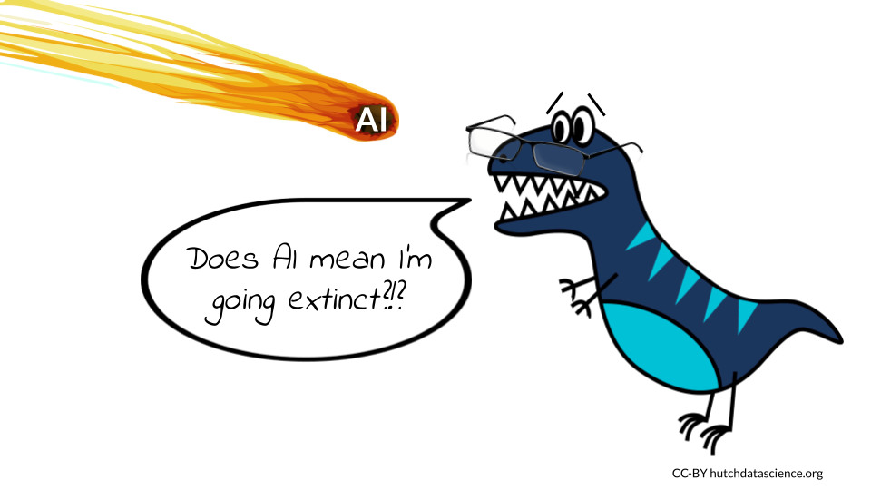
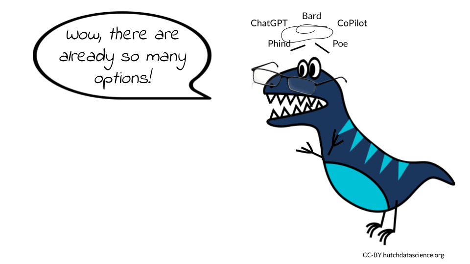

# Introduction

The increasing availability of AI chatbots is creating a new landscape in software development and data science. It is important to be aware of the potential benefits and challenges of this technology, so that we can use it in a way that benefits everyone and limits harm as much as possible.

On the one hand, AI chatbots have the potential to replace or significantly reduce the workload of programmers. This could lead to job losses in the data science industry. Additionally, there are significant ethical and privacy concerns regarding the use of training data sets to teach these AI systems. For example, if a chatbot is trained on a dataset of biased or discriminatory data, it could perpetuate those biases in its interactions with users.

On the other hand, AI chatbots also have the potential to create new jobs and opportunities. For example, chatbot developers will be needed to create and maintain these AI systems. Additionally, AI chatbots could be used to automate tasks that are currently done by humans, freeing up programmers to focus on more creative and strategic work of interpreting what the data actually mean.

Ultimately, while the future of programming in software development and data science is unclear, there is much to be optimistic about in this brave new world. The advancements in AI and chatbot technology present an opportunity for programmers to work alongside algorithms to create innovative solutions that were previously unimaginable. As with any technological revolution, there will be challenges, but it is up to us to work together to ensure that we use these tools ethically and responsibly, and to create a future that benefits everyone.

## Learning Objectives

In this chapter we will demonstrate how to:

- Consider the potential benefits and limitations of AI for software development
- Recognize how to use this course, how it was written, and what to expect
- Explain general concepts for ethical use of AI tools for software development
- Summarize what Chatbots are and how they work
- Distinguish between different AI options for software development

## AI Provides New Opportunities



We do not believe that AI chatbots will replace programmers, software developers, and data scientists. While AI can be powerful and useful, it is only as good as the training data behind it and the human using it. Therefore, for the time being and the foreseeable future, humans will remain at the forefront of programming innovation, with AI providing valuable support. As new code is often built on top of existing code written by humans, it is unlikely that AI will fully replace the need for human programmers.

However, we *do* think that the roles of programmers in software development and data science are changing, and some of the skills required to work in this new environment are slightly different from those needed before. In addition to proficiency in programming syntax, programmers may need to develop a more refined ability to construct queries that enable AI bots to create the desired workflows. Other critical skills such as debugging, troubleshooting, and documentation will continue to be valuable, and can be enhanced through the use of AI.

Furthermore, AI creates new opportunities and niches for tasks that were previously difficult, time-consuming, or impossible. This is an exciting time for those working in programming, with great potential to explore new and innovative solutions. As AI technology continues to advance, its role in programming will only become more significant, and it is up to developers to adapt and learn how to use these new tools effectively.

::: reflection
We asked OpenAI's ChatGPT whether AI chatbots would replace human software developers, data scientists, and programmers, and this was the response:

"It is unlikely that AI chatbots will replace software developers, data scientists, and programmers entirely. While AI chatbots can perform certain tasks related to software development, data analysis, and programming, they are limited in their abilities and require human oversight and input to function properly.

AI chatbots can be used to automate certain tasks such as generating simple code snippets, running tests, and performing simple data analysis. They can also assist in the development process by providing quick answers to commonly asked questions and suggesting possible solutions to programming problems.

However, more complex software development, data analysis, and programming tasks require a level of creativity, critical thinking, and problem-solving that AI chatbots cannot currently replicate. Software developers, data scientists, and programmers have a deep understanding of the technologies and tools used to develop AI chatbots, as well as the ability to optimize and improve those tools.

Furthermore, software development, data analysis, and programming require a high level of human communication and collaboration, which AI chatbots cannot currently replicate. Humans are also essential in making ethical decisions related to AI development, such as ensuring that AI systems are transparent, fair, and unbiased.

In summary, while AI chatbots can provide valuable assistance to software developers, data scientists, and programmers, they are unlikely to replace them entirely. Human expertise, creativity, and critical thinking will continue to be essential in developing and optimizing AI systems for the foreseeable future."
:::


## The AI Chatbots

Humans have been interacting with AI chatbots for years. In fact, Alan Turing is credited with coming up with the concept for chatbots as early as 1950. Chatbots are software-based systems that interact with humans typically by text or speech inputs, rather than code. They mimic some human activity [@wikipedia_chatbot_2023; @abdulla2022chatbots] based on these language inputs. They process the inputs using natural language processing commonly abbreviated as NLP. NLP is a kind of AI that uses human text or speech and parses the language to determine structures and patterns to extract meaning. NLP uses large amounts of language data (such as books, websites etc.) to train AI systems to identify these structures and patterns. For example, the AI model might identify when a sentence is a question or a statement by examining various features in a prompt such as the inclusion of a question mark of the use of words often used in questions [@wikipedia_natural_2023; @cahn2017chatbot].

The methods used for chatbots have evolved over time. Now chatbots often utilize AI methods like [deep learning](https://en.wikipedia.org/wiki/Deep_learning) (which involve multiple layers of abstractions of the input data [@wikipedia_deep_learning_2023]) to extract meaning from the language data [@wikipedia_natural_2023]. As these methods use large quantities of text, they are therefore often called large language models, or LLMs [@wikipedia_large_language_2023].

Although it might _seem_ like LLMs are talking to you when you interact with them, it's important to remember they aren't actually thinking. Instead, LLMs are simply putting together tokens, or parts of words, based on a huge distance matrix created using an LLM's training data set. Essentially, an LLM's program figures out how frequently (and in what contexts) different words show up together in the training data. For example, the word "example" is often paired with the word "for" in the text for this course. An LLM trained on this course would then be more likely to create the phrase "for example" than the phrase "for apples", as the training data includes multiple instances of the first phrase but only one instance of the second. (To be precise, the LLM would predict the tokens "ex", "am", and "ple", but we see it as the word "example".) If you're interested in learning more, check out this excellent [visual article](https://ig.ft.com/generative-ai/) by the Financial Times (we are not affiliated with them).

Despite the fact that chatbots have been around awhile, the popularity of OpenAI's ChatGPT and DALL-E programs has sparked a recent surge of interest. These chatbots are in part particularly powerful due to the fact that large amounts of computing power were used to train their NLP models on very large datasets [@caldarini2022literature; @cahn2017chatbot]. Large language model AIs can be divided into two categories: those that can be reached using an internet browser, and those that can be reached using an integrated development environment (IDE).

::: warning
The information presented in this course is meant for use with open source code and software. It is unclear what happens to the information fed to AI chatbots as prompts, or how secure the data are. We know data are saved and may be used to further train the AI tools, but the specifics of how data are saved, as well as how sensitive or personally identifiable information are protected, is unknown.

Err on the side of caution when interacting with them. We do **not** recommend using proprietary code or private information for prompts unless you are working with an AI that you or your company built and you know is secure.
:::



This is not a comprehensive list!

**Browser-based chatbots**

-   [Bard](https://bard.google.com/) is Google's large language model, also known as a conversational AI or chatbot trained to be informative and comprehensive. It is trained on a massive amount of text data and is able to communicate and generate human-like text in response to a wide range of prompts and questions. You will need to join the waiting list before getting access, although in our experience the wait time is short.

-   [ChatGPT](https://chat.openai.com/) is OpenAI's large language model based on the GPT (Generative Pre-trained Transformer) architecture. It is designed to understand and generate human-like responses to text-based conversations. You will need to create an account before using it.

-   [Phind](https://www.phind.com/) is a AI-powered search engine designed specifically for developers asking technical questions. In addition to answering your coding question, it will provide links to the internet sources used to find the answer.

-   [Poe](https://poe.com/) is Quora's platform that gives you access to multiple AI chatbots, including Sage, based on OpenAI's GPT-3.5 architecture; Claude, an AI natural language bot created by [Anthropic](https://www.anthropic.com); Llama 2, created by [Meta](https://ai.meta.com/llama/), and ChatGPT.

**IDE-based chatbots**

-   [CoPilot](https://github.com/features/copilot) by GitHub is a language bot that interfaces with your editor. This bot provides coding suggestions and ways to speed up testing. GitHub describes it as an "AI pair programmer". It uses a subscription model with both individual and business tiers.

-   [CodeWhisperer](https://aws.amazon.com/codewhisperer/) is the Amazon Web Services chatbot for the AWS cloud platform. It can be installed in your integrated development environment (IDE) using the latest AWS Toolkit plugin. The individual tier for CodeWhisperer is free, although you will need to create an AWS account and add a payment method.

::: reflection
What are the data sources for these chatbots? Some high-profile English-language AIs, including Google's T5 and Facebook's LLaMA, were trained on more than 15 million websites [@washingtonpost2023]. The top sources of training data for these AI models were <https://patents.google.com/> and <https://www.wikipedia.org/> !
:::

## Reproducibility With AI Chatbots

_Reproducibility_ in programming is the ability to reproduce the results of an analysis using the same data and methods. It's an important aspect of working with AI tools as well, particularly when using AI to debug or fix code. 

In order to maximize the reproducibility of your work, you should create good habits when working with any AI tool. This includes documenting your prompts and the intentions behind them, as well as saving the response threads generated by an AI chatbot. Some of the current chatbots already save your threads (particularly ChatGPT and Phind). At this time, Bard and the chatbots accessible via Poe do not save queries as individual threads but do keep a record of the questions and responses for some time. However, it is best practice to save them yourself as the saved chat threads can be reset. Saving them yourself also allows you to write notes about your intentions. 

Keep in mind that the answers from the chatbots can change over time - don't expect them to always be the same! Phrasing a query slightly differently can result in a different answer, as can asking in a new session. You should expect to ask the AI tool the same question in multiple ways in order to be confident in the answer.

## How to Use This Book

This book is written with the expectation that users will follow along and paste the queries from each example into their own AI chatbot session. After you have finished this book, you will be able to use whichever combination of chatbot and programming environment that you're comfortable using.

### Choice of AI Model

You can use whichever AI you like for this course, as long as it is a large language model. (Other types of AIs are not explored in this course.) We will use a variety of browser-based chatbots as examples throughout this course. Some AIs will be better suited for your particular tasks, and it is too early to judge which of the technologies will end up dominating the industry. We encourage you to test multiple AI platforms to find the ones that best fit your needs, and **the use of a particular AI in each chapter should not be taken as an endorsement by us.**

We have focused on the browser-based chatbots for our examples in this course for ease of demonstration.

### Computing Environment Needs

All the examples and activities in this course can be done in the computer environment you prefer. None of the tasks require a huge amount of computing power, so local installations on your personal computer are fine, though everything will also translate to a high performance computing cluster or a cloud computing platform.

In addition to the CodeWhisperer chatbot available on the AWS cloud platform, a variety of cloud-based AI tools and platforms exist that can be leveraged for practical projects after this course. For instance, Amazon SageMaker or Google Cloud AI Platform can be used for constructing and training machine learning models, while Microsoft Azure Cognitive Services can be applied to incorporate natural language processing features into your applications. If you'd like to learn more about how AI can be integrated with cloud computing, you can read about it in the Additional Learning section.

### Boxes

Throughout this course, you will see several types of specially-colored boxes. In particular, there are two to which you should pay special attention. One box highlights potential ethical issues with an AI usage.

::: ethics
In this box, you'll find reminders of the ethical considerations you should be particularly aware of while using AI to do certain tasks.
:::

The other box highlights our queries to AI chatbots.

::: query
The question we posed to the AI chatbot is written in these boxes to make it easier for you to find.
:::

Wherever possible, we use screenshots of the actual answers we got from the AI chatbots in response to our questions. Occasionally when we have asked for the AI to write or fix code, we have formatted the answer in such a way that makes it easier to use.

::: ai_response
When you see this format, you will know it indicates an AI response

```         
Code in these boxes was written by AI. 
```
:::

## About This Book

We used AI bots (including ChatGPT, Bard, Sage, and Claude) as part of the process of creating this book. The words are all original content, but we used AI bots to edit for grammar and tone. We firmly believe this new technology can be used in ethical ways and we put into practice all the rules and suggestions offered over the following modules while we created this book.

# VIDEO: AI Code of Ethics

This video covers a set of ethical guidelines to keep in mind while using AI tools for programming.

<iframe width="560" height="315" src="https://www.youtube-nocookie.com/embed/uyCNct8LNU4" title="YouTube video player" frameborder="0" allow="accelerometer; autoplay; clipboard-write; encrypted-media; gyroscope; picture-in-picture" allowfullscreen></iframe>

You can view and download the Google Slides [here](https://docs.google.com/presentation/d/1-SSnmgtVDGTQnjz0hOXuJMK0sMQEXS_0y4wIGT7fKy4/edit#slide=id.p).

Our first duty as programmers is to avoid causing harm to people and the world. This includes avoiding both intentional and inadvertent harm. *Intentional harm* is harm that is caused by a programmer's deliberate actions. For example, a programmer might create a virus that is designed to harm computers. *Inadvertent harm* is harm that is caused by a programmer's negligence or lack of foresight. For example, a programmer might create a program that is buggy and causes data loss, or create a program that is particularly vulnerable to being hacked.


We must always be aware of the potential for harm and deliberately take steps to mitigate it. This includes things like:

**Be aware of the potential for bias.** AI systems are trained on data, and that data can reflect the biases of the people who collected it. Programmers should be aware of the potential for bias in their data and take steps to mitigate it.

**Be transparent about your work.** Share information about your code, data, and algorithms. This will help others to understand how your work works and to identify any potential problems.

**Be accountable for your work.** Take responsibility for the consequences of your code. Be willing to make changes if necessary.

**Participate in discussions about AI ethics.** There are many online and in-person communities where you can discuss the ethical implications of AI with other people.

**Advocate for ethical AI.** Speak up when you see AI being used in a way that you believe is unethical. Support organizations that are working to promote ethical AI.

