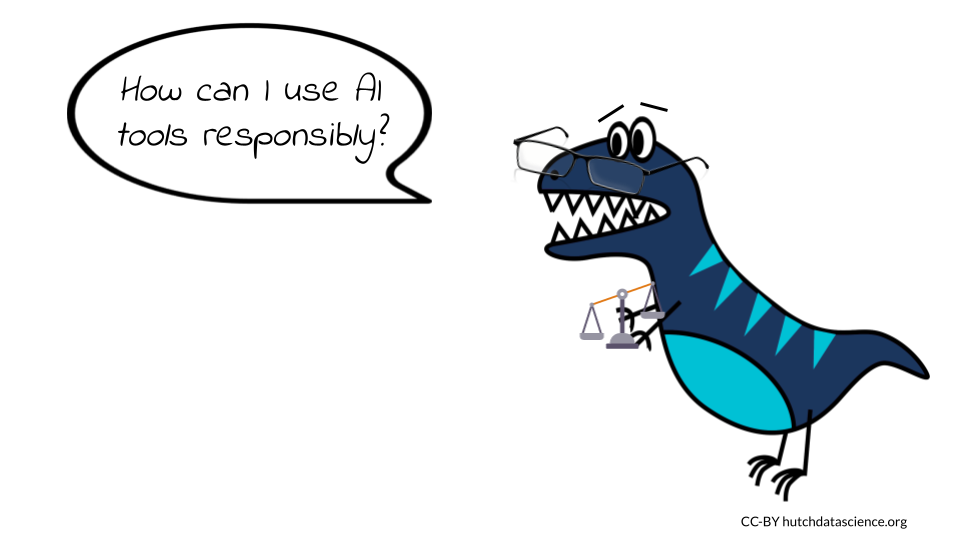
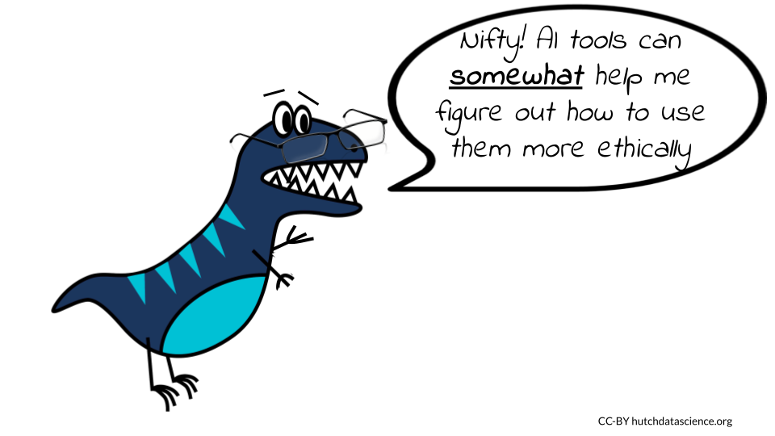

# Ethics of Using AI

The use of artificial intelligence (AI) and in particular, generative AI, in coding has raised a number of ethical concerns. We will highlight several current concerns, however please be aware that this is a dynamic field and the possible implications of this technology is continuing to develop. It is critical that we as a society continue to evaluate and predict what the consequences of the use of AI will be, so that we can mitigate harmful effects.

## Learning Objectives

In this chapter we will demonstrate how to:

- Describe key ethical concerns for using AI tools in software development
- Identify possible mitigation strategies for these major concerns
- Explain the potential benefits of being transparent about the use of AI tools to write code
- Discuss why human contributions are still important and necessary 
- Recognize strategies for using AI tools to write code more responsibly
- Implement prompts to ask AI tools about responsible use throughout various coding practices

## Major concerns

In this chapter we will discuss the following issues that writing code with AI tools may contribute to:

1) **Replacing Humans** - AI tools can help humans write code, but they are not a replacement.
1) **Bias** - AI models are built on data and code that were created by biased humans, this bias can be further perpetuated.
1) **Misinformation** - fake or manipulated data used to help design algorithms could be believed to be correct and this could be further propagated.
1) **Unintelligible Code** - Developers need to follow best practices with code generated by AI. Just like code generated by human developers, this includes figuring out how the code works, how it integrates with other code, as well as annotating and documenting how to use the code .
1) **Faulty or Buggy Code** - Code that may not be optimal for a given situation may be inadvertently used by those with less familiarity, which may result in faulty software.
1) **Security or Privacy Issues** - Code may not be optimized for security if not adequately evaluated. Generative AI models have access to large amounts of data that is currently unregulated and may include data that should be protected for privacy reasons.
1) **Copyright Violations** - The code used for the generative AI model may used code that has copyright laws that require attribution or do not allow reuse and it may not be clear where the code came from.
1) **Harmful Code** - Currently it is not clear how well generative AI models restrict the creation of code that will be used for goals that harm others.

Note that this is an incomplete list; additional ethical concerns will become apparent as we continue to use these new technologies. We highly suggest that users of these tools be **transparent** about the use of these tools, so that as new ethical issues emerge, we will be better prepared to understand the implications for specific coding projects.

:::{.ethics}
Be transparent about what AI tools you use to write code. This help others to better understand how you created your code, as well as the possible sources that the AI tools might have used when helping you write code. It may also help with future unknown issues related to the use of these tools.

Some organizations and scientific societies have created guidelines or requirements for using AI in journal articles and conference submissions, like the [International Society for Computational Biology](https://www.iscb.org/iscb-policy-statements/iscb-policy-for-acceptable-use-of-large-language-models). Be aware of the requirements/guidelines for your field.
:::

**It is essential to address these ethical concerns and ensure that the use of AI in coding is done in a responsible and transparent manner.** This could be done through ensuring the quality of the data used to train AI systems, promoting transparency in AI-generated code, and implementing safeguards against the creation of harmful or biased code. By doing so, we can harness the potential of AI to improve and transform the way we write and optimize code while maintaining ethical standards.

## Replacing Humans

Those who use AI tools to write code or to understand code need to recognize their own value in the process. While AI systems are useful, they **do not replace the strengths that humans have** for innovating new ways to write code, evaluating how the code integrates into the larger picture of a project, or in evaluating the downstream consequences of the code. 

Computer science is a field that has historically lacked diversity and new learners can often feel intimidated. There is the potential that new learners may feel even more discouraged as they learn to write code when witnessing AI tools write code. It is critical that we support diverse new learners of computer science, as we will continue to need human involvement in the development and use of AI tools.

### Tips for supporting human code

* Follow best teaching practices for inclusion of diverse learners.
* Encourage current and future programmers to continue to innovate and write code. 
* Avoid thinking that code written by computers must be better than code written by humans, as this simply is not true. 
* Recall that humans first wrote they code that the AI tools use to write code.
* Be transparent about when you do or do not use AI tools, give credit to the humans who write code where possible.

:::{.ethics}
A new term in the medical field called [AI paternalism](https://www.technologyreview.com/2023/04/21/1071921/ai-is-infiltrating-health-care-we-shouldnt-let-it-make-decisions/) describes the concept that doctors (and others) may trust AI over their own judgment or the experiences of the patients they treat. This has already been shown to be a problem with earlier AI systems intended to help distinguish patient groups. Not all humans will necessarily fit the expectations of the AI model if it is not very good at predicting edge cases [@AI_paternalism]. Therefore, in all fields it is important for us to not forget our value as humans in our understanding of the world. 
:::

## Bias

One of the biggest concerns is the potential for AI to create biased code. AI systems are trained on data created by humans. If this data  used to train the system is biased (and this includes existing code that may be written in a biased manner), the resulting code could also be biased. This could lead to discrimination, abuse, or neglect for certain groups of people, such as those with certain ethnic or cultural backgrounds, genders, ages, sexuality, capabilities, religions or other group affiliations. 

It is well known that data and code are often biased [@belenguer_ai_2022]. It is important that evaluations be made throughout the software development process to check for and consider potential perpetuation of bias.

### Tips for avoiding bias

* Be aware of the potential biases in the data that is used to train AI systems. 
* Check for possible biases within the data.
  - Are there harmful data values? Examples could include discriminatory and false associations.
  - Are the data adequately inclusive? Examples could include a lack of data about certain ethnic or gender groups or disabled individuals, which could result in code that does not adequately consider these groups, ignores them all together, or makes false associations.
  - Are the data of high enough quality?  Examples could include data that is false about certain individuals. 
* Evaluate the code for biases as it is developed. Check if any of the criteria for weighting certain data values over others are rooted in bias.
* Consider the possible outcomes of the use of the code. Consider if the code could possibly be used in a manner that will result in discrimination.

See @belenguer_ai_2022 for more guidance. We also encourage you to check out the following video for a classic example of bias in AI:

<iframe width="560" height="315" src="https://www.youtube-nocookie.com/embed/TWWsW1w-BVo" title="YouTube video player" frameborder="0" allow="accelerometer; autoplay; clipboard-write; encrypted-media; gyroscope; picture-in-picture; web-share" allowfullscreen></iframe>

## Misinformation

AI tools use data that may contain false information. AI tools may also report data as if it is real, when it is in fact not real. For example, currently at the time of the writing of this course, ChatGPT will report citations with links that are not correct. 

### Tips for reducing misinformation

* Be aware that some AI tools currently make up false information based on artifacts of the algorithm. 
* Do not assume that everything that the algorithm produces is real or correct. 

## Unintelligible Code

There is risk that those less aware of best coding practices use AI-generated code and do not follow these practices. This could make it difficult for others to understand how the code works and could make it hard to identify and fix any issues that may arise. This could result in negative consequences, such as system crashes or security breaches, that could have been avoided if the code had been written by an experienced and savvy human programmer.

### Tips for avoiding unintelligible code

 * Code should be reviewed by experienced programmers.
 * Code should be annotated throughout to explain what the code is doing.
 * Documentation should be created that describes how to use the code properly.
 * Ask AI tools to help you understand the code, but get expert assistance where needed.
 
:::{.query}
Can you explain what the code in line 4 is doing?
:::
 

## Faulty or Buggy Code

There is a risk that code written with AI tools, if not reviewed carefully enough, may be faulty. AI systems may not be trained on data that relates to current software dependencies or best practices. It is also important to remember that code generated by AI tools is not necessarily better than code written by humans. It requires just as much code review. 

### Tips for reducing faulty or buggy code

* Do not assume that the code generate by AI is correct.
* Realize that AI is only as good or up-to-date as what it was trained on, the code may be generated using out-of-date code. Look up packages and functions used to ensure if the code is up-to-date.
* Make sure that you understand the code that you are using. AI can be used to help you understand what the code is doing, but consult with experts when needed.
* Ask the AI tools for extra information about if there are any potential limitations or weaknesses in the code, but keep in mind that the tool may not be aware of issues and therefore human review is required. The information provided by the tool can however be a helpful starting point.

:::{.query}
Are there any limitations associated with this code?
:::

:::{.query}
What assumptions were made in writing this code?
:::

:::{.ethics}
[Stack Overflow](https://stackoverflow.com/), a popular community-based website where programmers help one another, has (at the time of writing this) temporarily [banned](https://meta.stackoverflow.com/questions/421831/temporary-policy-chatgpt-is-banned) users from answering questions with AI-generated code. This is because users were posting incorrect answers to questions. It is important to follow this policy (as you may face removal from the community). This policy goes to show that you really need to check the code that you get from AI models. While they are currently helpful tools, they do not know everything. 
:::

## Security and Privacy issues

AI tools are not always trained in a way that is particularly conscious of data security. Furthermore, if the code is written using these tools by users who are less familiar with coding security concerns, protected data or important passwords may be leaked within the code itself. AI systems may also utilize data that was actually intended to be private. It is also important to consider what data your code might actually be using.

### Tips for reducing security and privacy issues

* Check that all passwords, access tokens (like API keys), security certificates are not saved in a public place where anyone can access or tamper with them.
* Check that no sensitive data, such as Personal Identifiable Information (PII) becomes public through the code.
* Utilize encryption and other security practices where needed.
* Consult with an expert about data security if you think your code could possibly cause someone to access protected data who is not authorized to access it.
* Promote for regulation of AI tools by voting for such standards where possible.
* Ask AI tools for help, but to not rely on them alone.

:::{.query}
Are there any security or privacy concerns associated with this code?
:::

## Violating Copyright

When AI systems are trained on data, they may also learn and incorporate code from that data. This means that AI-generated code could potentially infringe on the copyright of the original author of the code. For example, if an AI system is trained on a GitHub repository that contains code written by a human programmer, the AI system could generate code that is identical to or similar to the code in the GitHub repository. If the AI system then uses this code without permission from the original author, this could constitute copyright infringement. In general, we want programmers to feel comfortable sharing their code openly without fear they won't be credited.
Similarly, AI systems could potentially infringe on intellectual property rights by using code that is protected by trademarks or patents. For example, if an AI system is trained on a training manual that contains code that is protected by a trademark, the AI system could generate code that is identical to or similar to the code in the training manual. If the AI system then uses this code without permission from the trademark owner, this could constitute trademark infringement.

### Tips for avoiding copyright violations

* Be transparent about what AI tools you use to write your code. 
* Obtain permission from the copyright holders of any code that you use to train the AI system. Only use code that is in the public domain or that has been licensed for use by the AI system's owner.
* Cite any GitHub repositories or training manuals you might use in your code.
* Ask the AI tools if the code it helped generate used any code that you can cite.

:::{.query}
Did this code use any code from others that I can cite?
:::

## Harmful code

Another major concern is the use of AI to generate malicious code. For instance, AI could be used to create code that spreads malware or hacks into computer systems. This could cause severe damage to individuals and organizations, including data breaches and financial losses.

### Tips for avoiding the creation of harmful code

* Be careful about what code you share publicly, as it could be used for malicious purposes.
* Consider how the code might be used by others.
* Ask the AI tools to help you, but do not rely on them alone.

:::{.query}
What are the possible downstream uses of this code?
:::

:::{.query}
What are some possible negative consequences of using this code?
:::

## Summary

Here is a summary of all the tips we suggested:

:::{.ethics}

* Disclose when you use AI tools to write code.
* Credit human authors by citing their code and adhering to copyright restrictions.
* Ensure the code doesn't expose sensitive data, such as passwords or PII.
* Don't assume AI-generated content is real, accurate, or current.
* Ask the AI tools to help you understand:
  * Sources for the code that you can cite
  * What the code is doing 
  * Code limitations 
  * Potential security or privacy issues
  * Potential downstream consequences of the code
* Always have expert humans review the code and value your own contributions and thoughts.

:::

Overall, we hope that these guidelines and tips will help us all to use AI tools more responsibly for writing code. We recognize however, that as this is emerging technology and more ethical issues will emerge as we continue to use these tools in new ways. AI tools can even help us to use them more responsibly when we ask the right additional questions when writing code, but remember that human review is always necessary. Staying up-to-date on the current ethical considerations will also help us all continue to use AI responsibly.

