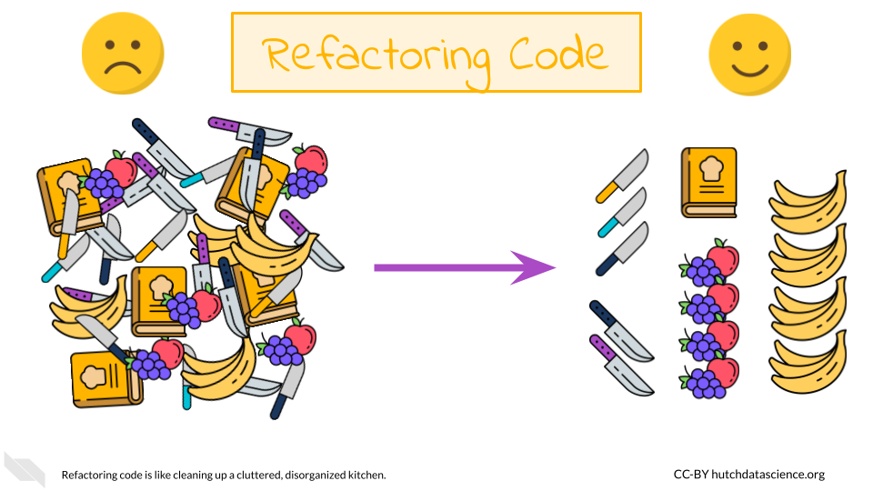

# Refactoring Code

[Code refactoring](https://en.wikipedia.org/wiki/Code_refactoring) is the process of improving the quality of underlying code without changing its functionality. In other words, it's a way of cleaning up and optimizing code so that it's easier to maintain and more efficient. This often involves making small changes to the code, such as renaming variables or functions, reorganizing code blocks, or simplifying complex expressions. Refactoring is an essential practice in software development and helps to ensure that the codebase remains manageable and adaptable as requirements and business needs change over time.

Code refactoring helps to reduce [technical debt](https://en.wikipedia.org/wiki/Technical_debt), which is the accumulation of development work that needs to be done in the future as a result of taking shortcuts or using less than optimal solutions. Refactoring can help to identify potential issues and bugs before they cause problems, resulting in more stable software. Finally, refactoring code to be more readable and less verbose can create fewer headaches for you in the future.

To understand why code refactoring is important, imagine trying to cook in a disorganized and cluttered kitchen. You might be a fantastic cook, but you are spending more time searching for utensils and ingredients, and the quality of the meal could suffer as a result. Similarly, code that is disorganized and cluttered can be difficult to work with and can result in lower-quality software. Refactoring is like cleaning and organizing the kitchen - it makes the process of cooking (or coding) smoother and more efficient.



## AI in Code Refactoring

Code refactoring has historically been done manually by developers. This involves reviewing code and identifying areas that could be improved or optimized, and then making changes to the codebase accordingly. Though important, this is process is time-consuming and labor-intensive, as it requires developers to carefully review every line of code to identify potential issues or areas for improvement. Additionally, manual code refactoring is error-prone, as developers can accidentally introduce bugs or errors into the codebase while making changes.

However, AI has significant potential to help with code refactoring. AI can use machine learning algorithms to analyze large amounts of code and identify patterns or areas that could be improved. For example, they can identify sections of code that are redundant, overly complex, or difficult to maintain, and suggest changes that could be made to improve the codebase. Machine learning algorithms can also help to identify potential bugs or security issues in the codebase, which can help to improve the overall quality and stability of the software.

AI refactoring is also faster and more accurate than manual refactoring. This is particularly useful for large-scale software projects with massive codebases, where manual code review and refactoring can be an enormous task. In the next sections, we'll take a look at some examples of using AI to refactor code.

## Example One: Correcting Syntax

Programming languages operate using their established set of rules. For example, [Python](https://www.python.org/) uses indentation to define code blocks. However, when you shift between development environments, indentation and line breaks can sometimes be affected, causing major headaches! 

Let's say we run the following code:


```python
def calculate_sum(a,b):
 result = a + b
  return result
def calculate_product(a,b):result = a * b
return result

def main():
  a=5
 b=6
sum_result = calculate_sum(a, b)
print("Sum:", sum_result)
product_result = calculate_product(a,b)
print("Product:", product_result)

if __name__ == '__main__':
main()
```

```
## unexpected indent (<string>, line 3)
```

We get the error above because our indentation is off. Let's ask [ChatGPT](https://chat.openai.com) to clean things up.

:::{.query}
"Can you assist me with correcting the formatting and indentation issues in my Python code?"
:::

:::{.ai_response}
Of course! Here is the code after correcting the formatting and indentation:


```python
def calculate_sum(a, b):
    result = a + b
    return result


def calculate_product(a, b):
    result = a * b
    return result


def main():
    a = 5
    b = 6
    sum_result = calculate_sum(a, b)
    print("Sum:", sum_result)
    product_result = calculate_product(a, b)
    print("Product:", product_result)


if __name__ == '__main__':
    main()
```

```
## Sum: 11
## Product: 30
```

:::

Much better! This can be quite handy when you can't immediately see what is wrong with the formatting or if you are working with a large codebase. 

## Example Two: Syntax Convention

Sometimes programming languages have more flexible rules where there are multiple ways to take the same or almost the same action. For example, in the [R programming language](https://www.r-project.org/), there are several ways to perform variable assignment. However, is is generally accepted among R programmers that the `<-` operator should be used. Single and double quotes can be used for character types interchangeably, but it's generally a good idea to stick with one or the other.

Let's say we have the following code:


```r
a <- "apple"
b = 'banana'
"carrot" -> c

c(a, b, c)
```

```
## [1] "apple"  "banana" "carrot"
```

This code does not produce any errors, but it doesn't follow typical R convention. Let's ask ChatGPT to clean things up.

:::{.query}
"Can you help me reformat my R code to follow accepted style conventions?"
:::

:::{.ai_response}
Sure, here's the cleaned-up R code:


```r
a <- "apple"
b <- "banana"
c <- "carrot"
```

:::

Much better! This code will now look more familiar to other R programmers.


## Example Three: Staying DRY

The DRY (Don't Repeat Yourself) programming tenet is essential to good software. By avoiding repetition in code, we can reduce the amount of duplicate code we need to write and maintain. If we need to change the functionality of a certain piece of code, we have to make the same change in multiple places, which can be time-consuming and error-prone.

Let's take the following Python code:


```python
def print_greetings():
    print("Hello, Alice!")
    print("Hello, Bob!")
    print("Hello, Carol!")
    print("Hello, David!")
    print("Hello, Eve!")

print_greetings()
```

```
## Hello, Alice!
## Hello, Bob!
## Hello, Carol!
## Hello, David!
## Hello, Eve!
```

Notice how repetitive this code is? `print()` and the string `"Hello, "` appear five times. We can improve this!

:::{.query}
"Could you please refactor my Python code to make it more DRY?"
:::

:::{.ai_response}
Sure, here's a refactored version of your code:


```python
def print_greeting(name):
    print(f"Hello, {name}!")

def print_greetings():
    names = ["Alice", "Bob", "Carol", "David", "Eve"]
    for name in names:
        print_greeting(name)

print_greetings()
```

```
## Hello, Alice!
## Hello, Bob!
## Hello, Carol!
## Hello, David!
## Hello, Eve!
```
:::

Now let's imagine your software lead has asked us to change the greeting to Spanish. Notice how we only have to change the second line of code:


```python
def print_greeting(name):
    print(f"¡Hola, {name}!")

def print_greetings():
    names = ["Alice", "Bob", "Carol", "David", "Eve"]
    for name in names:
        print_greeting(name)

print_greetings()
```

```
## ¡Hola, Alice!
## ¡Hola, Bob!
## ¡Hola, Carol!
## ¡Hola, David!
## ¡Hola, Eve!
```

Much easier.

## Example Four: Keeping Code Alive

During software development, code is often changing rapidly. It's common to end up with functions or variables you don't need anymore. It's best practice to remove "dead" code from your codebase: it's distracting and can make maintenance more challenging. Programmers should resist the urge to hang on to unused code in the expectation that they might need it one day. Version control, such as provided by git and GitHub, let you keep a record of old code without cluttering your final version.

Let's take a look at some Python code with some dead code:


```python
def default_values():
    a = 5
    b = 6
    return a, b

def calculate_sum(a, b):
    result = a + b
    return result

def calculate_product(x, y):
    return x * y
  
def simulate_data():
    a, b = default_values()
    dat = calculate_sum(a, b) + calculate_sum(a, b)
    return dat

def main():
    a = 5
    b = 6
    a, b = default_values()
    sum_result = calculate_sum(a, b)
    print("Sum:", sum_result)

if __name__ == '__main__':
    main()
```

```
## Sum: 11
```

Some of these functions aren't used in the final step, typically defined in python as the `main()` function. Let's ask AI to remove them.

:::{.query}
"I need help with eliminating unused functions in my Python script."
:::

:::{.ai_response}
Sure! Here's a refactored version:


```python
def default_values():
    a = 5
    b = 6
    return a, b

def calculate_sum(a, b):
    result = a + b
    return result

def main():
    a = 5
    b = 6
    a, b = default_values()
    sum_result = calculate_sum(a, b)
    print("Sum:", sum_result)

if __name__ == '__main__':
    main()
```

```
## Sum: 11
```
:::

Great! Now our code is much more manageable. This code only includes the necessary functions needed to run the `main()` function. We can go a step further!

:::{.query}
"Can you help me refactor my python code to make it more concise?"
:::

:::{.ai_response}
Certainly! Here's a more concise version of your code:


```python
def calculate_sum(a=5, b=6):
    return a + b

def main():
    sum_result = calculate_sum()
    print("Sum:", sum_result)

if __name__ == '__main__':
    main()
```

```
## Sum: 11
```
:::

In this version, the `calculate_sum` function is simplified to take default arguments for a and b. This means the `default_values` function is no longer necessary. The a and b variables are also removed from `main`, as they are no longer needed. Much better and easier to look at overall.

## Code optimization

loops!

## Case studies / examples in industry (if any)

## Common mistakes / edge cases / things to watch out for

## Challenges / limitations

## Hands-On Exercise

Now it's your turn to try. Let's say you ...

**Note**: This code is just an example and was written strictly for educational purposes.


```r
devtools::session_info()
```

```
## ─ Session info ───────────────────────────────────────────────────────────────
##  setting  value                       
##  version  R version 4.0.2 (2020-06-22)
##  os       Ubuntu 20.04.5 LTS          
##  system   x86_64, linux-gnu           
##  ui       X11                         
##  language (EN)                        
##  collate  en_US.UTF-8                 
##  ctype    en_US.UTF-8                 
##  tz       Etc/UTC                     
##  date     2023-04-14                  
## 
## ─ Packages ───────────────────────────────────────────────────────────────────
##  package     * version date       lib source                            
##  assertthat    0.2.1   2019-03-21 [1] RSPM (R 4.0.5)                    
##  bookdown      0.24    2023-03-28 [1] Github (rstudio/bookdown@88bc4ea) 
##  bslib         0.4.2   2022-12-16 [1] CRAN (R 4.0.2)                    
##  cachem        1.0.7   2023-02-24 [1] CRAN (R 4.0.2)                    
##  callr         3.5.0   2020-10-08 [1] RSPM (R 4.0.2)                    
##  cli           3.6.1   2023-03-23 [1] CRAN (R 4.0.2)                    
##  crayon        1.3.4   2017-09-16 [1] RSPM (R 4.0.0)                    
##  curl          4.3     2019-12-02 [1] RSPM (R 4.0.3)                    
##  desc          1.2.0   2018-05-01 [1] RSPM (R 4.0.3)                    
##  devtools      2.3.2   2020-09-18 [1] RSPM (R 4.0.3)                    
##  digest        0.6.25  2020-02-23 [1] RSPM (R 4.0.0)                    
##  ellipsis      0.3.1   2020-05-15 [1] RSPM (R 4.0.3)                    
##  evaluate      0.20    2023-01-17 [1] CRAN (R 4.0.2)                    
##  fansi         0.4.1   2020-01-08 [1] RSPM (R 4.0.0)                    
##  fastmap       1.1.1   2023-02-24 [1] CRAN (R 4.0.2)                    
##  fs            1.5.0   2020-07-31 [1] RSPM (R 4.0.3)                    
##  glue          1.4.2   2020-08-27 [1] RSPM (R 4.0.5)                    
##  here          1.0.1   2020-12-13 [1] CRAN (R 4.0.2)                    
##  highr         0.8     2019-03-20 [1] RSPM (R 4.0.3)                    
##  hms           0.5.3   2020-01-08 [1] RSPM (R 4.0.0)                    
##  htmltools     0.5.5   2023-03-23 [1] CRAN (R 4.0.2)                    
##  httr          1.4.2   2020-07-20 [1] RSPM (R 4.0.3)                    
##  jquerylib     0.1.4   2021-04-26 [1] CRAN (R 4.0.2)                    
##  jsonlite      1.7.1   2020-09-07 [1] RSPM (R 4.0.2)                    
##  knitr         1.33    2023-03-28 [1] Github (yihui/knitr@a1052d1)      
##  lattice       0.20-41 2020-04-02 [2] CRAN (R 4.0.2)                    
##  lifecycle     1.0.3   2022-10-07 [1] CRAN (R 4.0.2)                    
##  magrittr      2.0.3   2022-03-30 [1] CRAN (R 4.0.2)                    
##  Matrix        1.2-18  2019-11-27 [2] CRAN (R 4.0.2)                    
##  memoise       2.0.1   2021-11-26 [1] CRAN (R 4.0.2)                    
##  ottrpal       1.0.1   2023-03-28 [1] Github (jhudsl/ottrpal@151e412)   
##  pillar        1.9.0   2023-03-22 [1] CRAN (R 4.0.2)                    
##  pkgbuild      1.1.0   2020-07-13 [1] RSPM (R 4.0.2)                    
##  pkgconfig     2.0.3   2019-09-22 [1] RSPM (R 4.0.3)                    
##  pkgload       1.1.0   2020-05-29 [1] RSPM (R 4.0.3)                    
##  png           0.1-8   2022-11-29 [1] CRAN (R 4.0.2)                    
##  prettyunits   1.1.1   2020-01-24 [1] RSPM (R 4.0.3)                    
##  processx      3.4.4   2020-09-03 [1] RSPM (R 4.0.2)                    
##  ps            1.4.0   2020-10-07 [1] RSPM (R 4.0.2)                    
##  R6            2.4.1   2019-11-12 [1] RSPM (R 4.0.0)                    
##  Rcpp          1.0.10  2023-01-22 [1] CRAN (R 4.0.2)                    
##  readr         1.4.0   2020-10-05 [1] RSPM (R 4.0.2)                    
##  remotes       2.2.0   2020-07-21 [1] RSPM (R 4.0.3)                    
##  reticulate  * 1.28    2023-01-27 [1] CRAN (R 4.0.2)                    
##  rlang         1.1.0   2023-03-14 [1] CRAN (R 4.0.2)                    
##  rmarkdown     2.10    2023-03-28 [1] Github (rstudio/rmarkdown@02d3c25)
##  rprojroot     2.0.3   2022-04-02 [1] CRAN (R 4.0.2)                    
##  sass          0.4.5   2023-01-24 [1] CRAN (R 4.0.2)                    
##  sessioninfo   1.1.1   2018-11-05 [1] RSPM (R 4.0.3)                    
##  stringi       1.5.3   2020-09-09 [1] RSPM (R 4.0.3)                    
##  stringr       1.4.0   2019-02-10 [1] RSPM (R 4.0.3)                    
##  testthat      3.0.1   2023-03-28 [1] Github (R-lib/testthat@e99155a)   
##  tibble        3.2.1   2023-03-20 [1] CRAN (R 4.0.2)                    
##  usethis       1.6.3   2020-09-17 [1] RSPM (R 4.0.2)                    
##  utf8          1.1.4   2018-05-24 [1] RSPM (R 4.0.3)                    
##  vctrs         0.6.1   2023-03-22 [1] CRAN (R 4.0.2)                    
##  withr         2.3.0   2020-09-22 [1] RSPM (R 4.0.2)                    
##  xfun          0.26    2023-03-28 [1] Github (yihui/xfun@74c2a66)       
##  yaml          2.2.1   2020-02-01 [1] RSPM (R 4.0.3)                    
## 
## [1] /usr/local/lib/R/site-library
## [2] /usr/local/lib/R/library
```
