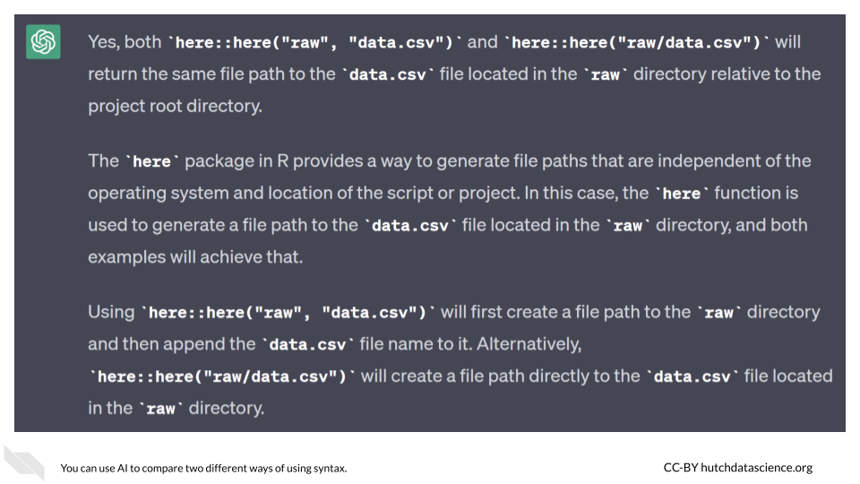
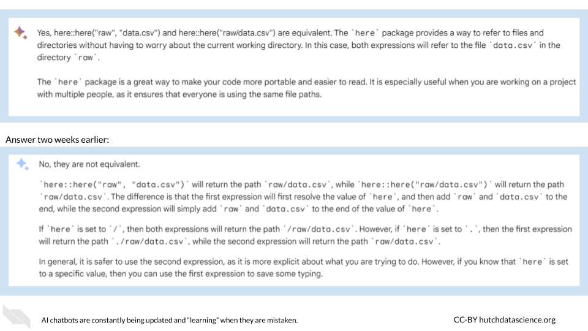
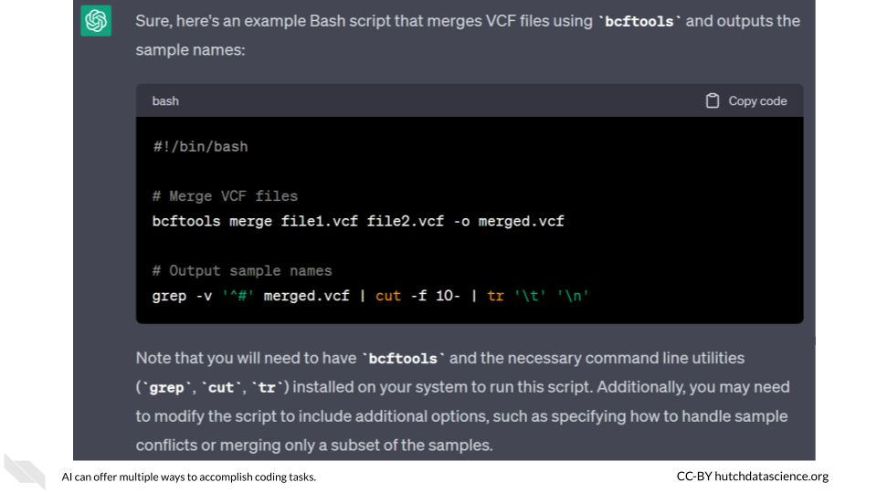
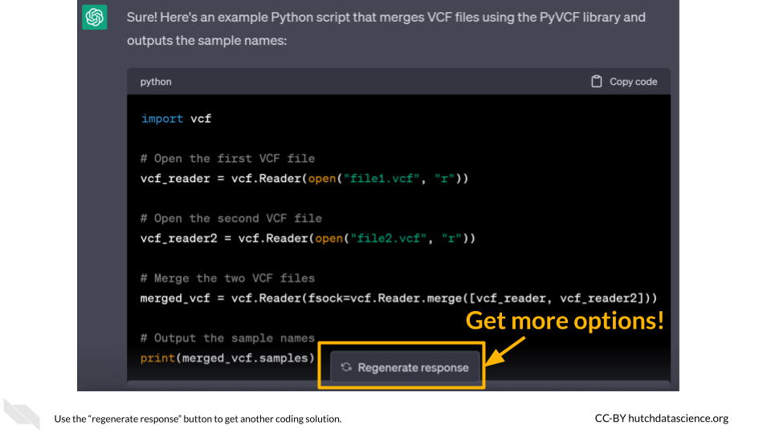
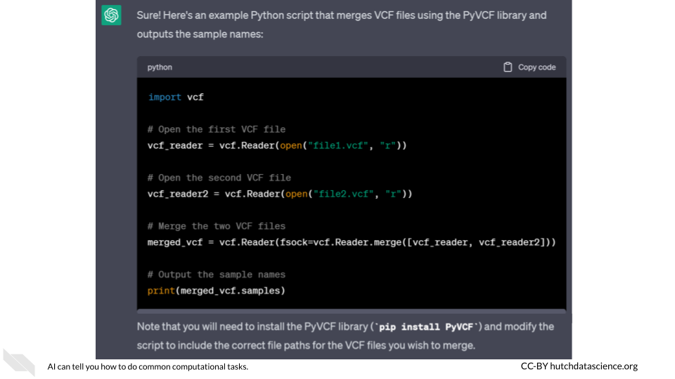
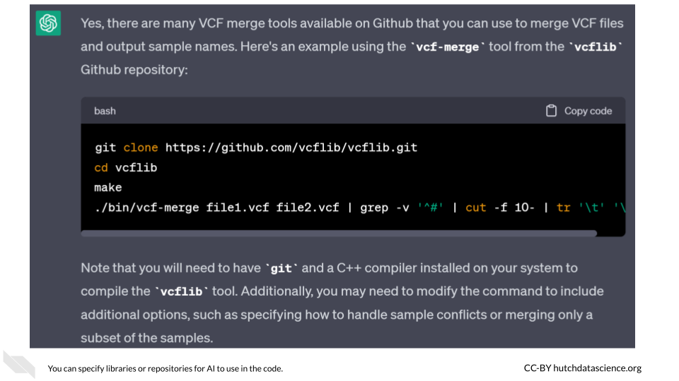
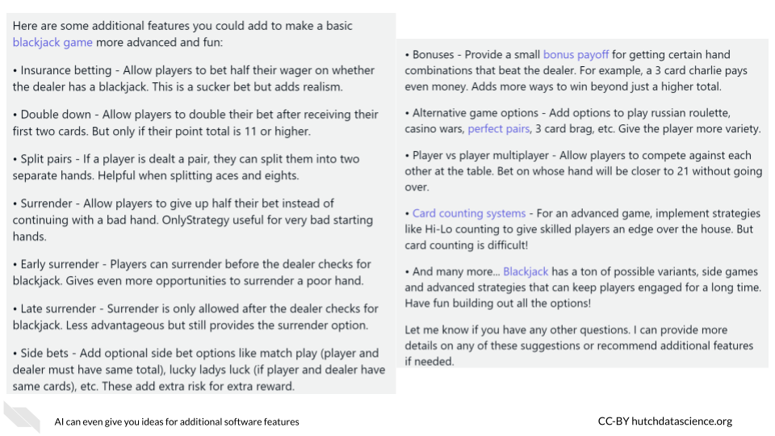
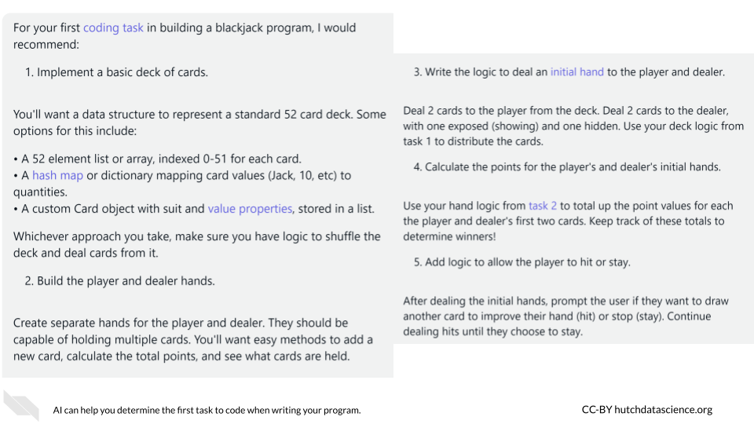
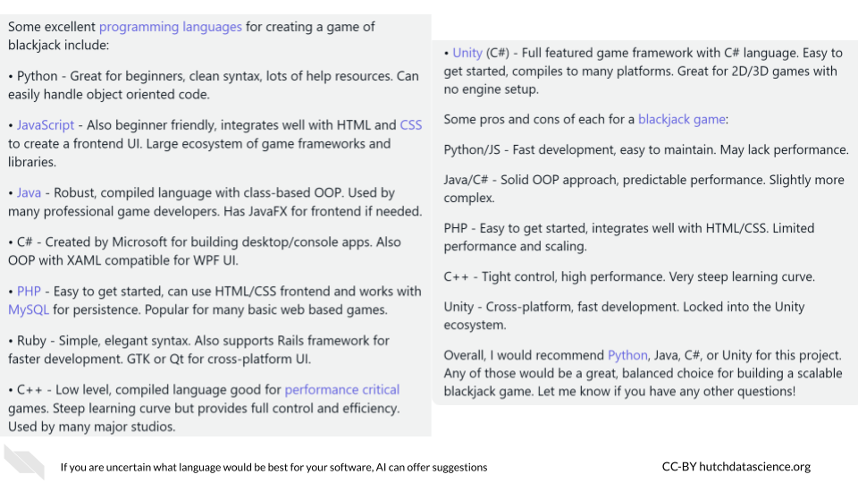
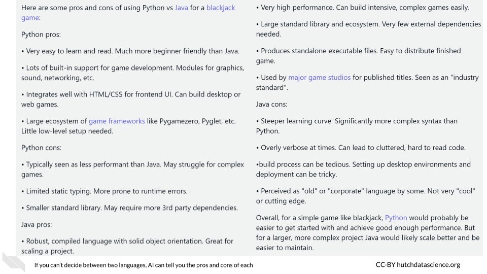

# Writing Code

## Learning Objectives

- Recognize the benefits and capabilities of AI-powered programming tools, particularly for certain kinds of tasks that are difficult for humans
- Explain how AI-generated code and automated programming tools contribute to making programming more accessible to individuals with limited coding experience or to those working in a new language
- Explore the ethical considerations associated with using AI in programming, including the importance of rigorous testing before publishing code
- Apply strategies for using AI to build functions, debug code, understand error messages, check syntax, choose the proper programming language, and plan out a multi-step programming project

## Coding Basics

In today's digitally-driven world, coding has become an essential skill. It is used to create websites, mobile applications, and sophisticated software systems. Contrary to popular belief, coding is not only for those who possess an innate talent for programming. With the right resources and a willingness to learn, anyone can become proficient in coding.

Practice is crucial to mastering the art of coding, and those who are willing to commit themselves to the learning process can achieve great results. Writing code can also be a rewarding and fulfilling hobby, too. Creating your own software, building a website, or automating a task can be immensely satisfying, and can provide a sense of accomplishment and pride.

Moreover, writing code can be a form of creative expression. Just as musicians use notes to compose music and artists use paint to create visual art, programmers use code to create digital experiences. From building websites to creating video games, code can be used to bring ideas to life in exciting and innovative ways.


Ultimately, the ability to write code is a valuable asset in today's world, with increasing demand for skilled programmers in a wide range of industries. Whether as a career or hobby, coding can be both personally and professionally rewarding. The accessibility and versatility of coding make it an excellent skill for anyone to learn, regardless of their background or previous experience. 


## Writing Code with AI


AI-powered programming tools and technologies are revolutionizing the way we approach software development. 

1. _AI can generate code snippets._ An AI-powered code editor can suggest more efficient algorithms or highlight potential errors in real-time. It can also help developers to reproduce bugs more easily and to test potential fixes more quickly. This can save developers a significant amount of time and effort, and it can help them to debug their code more effectively. **Be aware that AI still makes a lot of mistakes when writing code**, so you will need to be particularly careful in testing code it writes.

1. _AI can make programming more accessible._ With AI-generated code and automated programming tools, individuals who are not experienced developers can still create software solutions. Experienced developers can also more easily write code in languages with which they aren't familiar. This has the potential to democratize programming and lead to new innovations from a wider range of people.

1. _AI is changing the skills required for writing code._ Rather than simply memorizing syntax, developers need to focus on developing their creativity, intuition, and problem-solving skills. Additionally, programmers must also hone their abilities in architecture design and project management, as these skills are becoming increasingly important in the modern software development landscape.

As AI continues to evolve, it is likely to have an even greater impact on the way we develop software in the future.

:::{.ethics}
**As a programmer using AI, it is up to you to be responsible for what you create.** You must rigorously test any code you write. It is your job to make sure any code you create with AI is not malicious and works as expected.
:::

:::{.notice}
Can complete novices learn how to program using AI tools?

At present, it is very challenging for complete novices to rely on AI chatbots to learn how to write code. These tools will sometimes write buggy code or code that doesn't not work as intended, and a person with no programming experience will have difficulty learning how to spot these sorts of mistakes. AI chatbots are best thought of as a supplement to your software development education, not as a replacement, and they should be used alongside other resources. Therefore, we advise that you seek expert review and assistance. As AI tools are refined, complete novices may be able to create software products more readily on their own.
:::

## Tips for Coding with AI

Using AI to write code is as much of an art as writing your own code.  Following a few rules and suggestions will make your experience much more enjoyable and productive.

**Remember that AI cannot read your mind**. You need to tell it what you're thinking, and it may take several rounds of question-and-answer before you get something you can work with. 

* _Be clear about your goals._ What do you want the AI to do? Be as specific as possible.

* _Start with a simple task._ Don't try to do too much too soon. Start with a simple task and then gradually work your way up to more complex tasks. You wouldn't write a complete program all at once, and you shouldn't have AI do it, either.

* _Provide enough data._ The more data (and detail) you can give the AI, the better it will be able to learn and perform the task you want it to do.

* _Be patient._ Querying an AI can take time. Don't expect it to be perfect right away.

**Test everything AI writes**. You are responsible for the code that AI generates, even if you didn't write it yourself. AI can be biased, just like humans, and this could lead to sub optimal development. There is a concern that AI may focus development on areas that optimize certain metrics but not overall quality, effectiveness, or user needs. Human judgment is still needed to ensure that AI is used in a responsible and ethical way.

* _Test your results._ Make sure the AI is actually doing what you want it to do. AI systems are trained on data, and if the data is not representative of the real world, the AI system may not be able to generate code that works correctly. It is important to test the code to make sure that it is working as intended and that it is producing the desired results. Inadequate testing could lead to low quality, buggy code. Since AI generated code would be highly automated, it requires strong testing procedures and safety oversight to ensure it meets standards before deployment. 

* _Make sure your code is secure._ AI systems can be used to generate code that is vulnerable to attack, and it is important to test the code to make sure that it is secure. This can help to prevent security breaches from occurring. 

* _Use a variety of AI models._ There are many different AI models available. Experiment with different models to see which one works best for your task.

* _Get feedback from others._ Ask other people to review your code and give you feedback. This can help you identify and fix any problems with your code.

## Example One: Creating a Function

One of the most common things a programmer does is write functions to automate tedious tasks. With proper guidance, AI can speed this process up.

Perhaps you need to write a quick function that reverses all the letters in a string. We can query [Phind](https://www.phind.com/) for help.

:::{.query}
How do I write a function that reverses the letters in a string?
:::

:::{.ai_response}
To reverse a string in Bash, there are multiple approaches.

One way to reverse a string is by using the `rev` command. According to [StackOverflow](https://stackoverflow.com/questions/11461625/reverse-the-order-of-characters-in-a-string), the `rev` command is installed on most Linux systems by default. To use the `rev` command, simply enter `rev` followed by the string you want to reverse. For example:

```
$ echo "12345" | rev
```

However, it is important to note that the rev command is not present in all flavors of Unix.

Another way to reverse a string is by using a simple Bash script. According to [StackOverflow](https://askubuntu.com/questions/1330942/how-to-reverse-a-string-in-bash-script), we can write a Bash script that reverses a string using a for loop. Here is an example script:

```
var="12345"
copy=\${var}

len=${#copy}
for((i=$len-1;i>=0;i--)); do rev="$rev\${copy:$i:1}"; done

echo "var: $var, rev: $rev"
```

This script takes the string "12345" and stores it in the variable `var`. It then creates a copy of the string and stores it in the variable `copy`. The length of the string is stored in the variable `len`. The for loop starts at the end of the string and iterates through each character, adding it to the variable `rev`. Finally, the script prints the original string and the reversed string.

Another approach to reversing a string is by using the `tac` command. According to [StackOverflow](https://askubuntu.com/questions/1330942/how-to-reverse-a-string-in-bash-script), we can use the `tac` command to reverse the contents of a file or the standard input. Here is an example command:

```
$ echo "12345" | sed 's/./&\n/g' | tac | sed -e :a -e 'N;s/\n//g;ta'
```

This command uses the `sed` command to insert a newline character after each character in the string. It then passes the output to the `tac` command, which reverses the order of the lines. Finally, another `sed` command is used to remove the newline characters and print the reversed string.

Overall, there are multiple approaches to reversing a string in Bash. The `rev` command, a simple Bash script with a for loop, and the `tac` command are all viable options.
:::


Phind offers you a variety of ways to do this, but all these options are in the language Bash. Because we didn't include a programming language in our query, Phind picked one for us. Let's refine our query a little.

:::{.query}
How do I write a function using Python that reverses the letters in a string?
:::

:::{.ai_response}
To write a function using Python that reverses the letters in a string, there are several approaches that can be taken.

One approach involves using a for loop and the `concatenation` operator to join the original string in reverse order. This technique is demonstrated in [realpython.com](https://realpython.com/reverse-string-python/) as follows:

```
def reverse_string(text):
    result = ""
    for char in text:
        result = char + result
    return result

print(reverse_string("Hello, World!")) # Output: '!dlroW ,olleH'
```

In this example, the function `reverse_string` takes a string as its argument and initializes an empty string result. The for loop iterates over each character in the input string, concatenating it with the current content of result and reassigning the new intermediate string to result at each iteration. At the end of the loop, result holds a new string as a reversed copy of the original one.

Another approach involves using slicing to reverse the string. This technique is demonstrated in [stackoverflow.com](https://stackoverflow.com/questions/25375794/how-to-reverse-the-order-of-letters-in-a-string-in-python) as follows:

```
def reverse_string(text):
    return text[::-1]

print(reverse_string("Hello, World!")) # Output: '!dlroW ,olleH'
```

In this example, the function `reverse_string` takes a string as its argument and returns the string in reverse order using slicing. The syntax text `[::-1]` means to slice the entire string with a step of -1, which reverses the order of the string.

A third approach involves using Python's built-in `reversed()` function to reverse the string. This technique is demonstrated in [datagy.io](https://datagy.io/python-palindrome/) as follows:

```
def reverse_string(text):
    return ''.join(reversed(text))

print(reverse_string("Hello, World!")) # Output: '!dlroW ,olleH'
```

In this example, the function `reverse_string` takes a string as its argument and uses the `reversed()` function to return an iterator that produces the characters of the string in reverse order. The `join(`) method is then used to convert the iterator back into a string.

All three approaches produce the same output, but they differ in terms of performance and readability. The first approach using a for loop and concatenation is the most straightforward, but it can be slower for large strings because it creates successive intermediate strings only to throw them away in the next iteration. The second approach using slicing is more efficient because it creates a new string object only once, but it may be less readable for some programmers. The third approach using `reversed()` is concise and readable, but it may be slower for large strings because it creates a reversed iterator that must be converted back into a string using `join()`.
:::


Once again, Phind has come through with multiple options. Now let's say you knew you wanted to write a function like this, but you realize it's only the strings in the third column of your file. Let's add that requirement to our query.

:::{.query}
"How do I write a function using python that reverses the letters in a string for the third column of my file?"
:::

:::{.ai_response}
To write a function using Python that reverses the letters in a string for the third column of a file, you can use the extended slice syntax in Python. The extended slice syntax is a more concise and faster way of slicing strings in Python. To reverse a string using extended slices, you can use the following syntax:

```
string[::-1]
```

In this syntax, the first colon indicates the start of the slice, the second colon indicates the end of the slice, and the third colon indicates the step size of the slice. By setting the step size to -1, you can reverse the string.

To create a function that reverses the letters in a string for the third column of a file, you can use the following code:

```
def reverse_string(string):
    return string[:2] + string[2:5][::-1] + string[5:]
```

In this code, the `reverse_string()` function takes a string as input and returns the string with its third column reversed. The first two characters of the string are returned as-is, while the third column (characters 3 to 5) are reversed using extended slices. Finally, the remaining characters of the string are returned as-is.

There are other ways to reverse a string in Python, including using loops, recursion, stacks, and function calls. However, using extended slices is the most concise and efficient way to reverse a string in Python.

Here are some pros and cons of using extended slices to reverse a string:

Pros:

* Concise syntax: using the extended slice syntax is a one-liner that is easy to read and write.
* Fast execution: using the extended slice syntax is faster than using loops or other methods to reverse a string.

Cons:

* Limited functionality: the extended slice syntax can only be used to reverse a string, and cannot be used for more complex string operations.
* Not beginner-friendly: the extended slice syntax is not intuitive for beginners who are not familiar with Python's slicing syntax.

In conclusion, to write a function using Python that reverses the letters in a string for the third column of a file, you can use the extended slice syntax in Python. This syntax is concise and efficient, but may not be beginner-friendly and may not be suitable for more complex string operations.
:::


## Example Two: Debugging Code

A vast amount of time in programming is spent on debugging code. Often the compiler error messages are very precise about what has gone wrong while simultaneously lacking enough detail for the programmer to immediately understand how to fix the error. It is good practice to debug code as you go, instead of writing the entire program and then testing to identify the errors. Using an AI chatbot makes this task much, much easier.

There are two options for using [ChatGPT](https://chat.openai.com/) for debugging. 

First, we could query what the error code means. Here's a Python code snippet that is throwing a `TypeError: unsupported operand type(s) for +: 'int' and 'str'` error when we try running it.

```
def add_numbers(a, b):
  result = a + b
  return result

number1 = 10
number2 = "20"

sum = add_numbers(number1, number2)
print("The sum of", number1, "and", number2, "is", sum)
```

:::{.query}
What does this error mean? TypeError: unsupported operand type(s) for +: 'int' and 'str'
:::

:::{.ai_response}
This error typically occurs when you try to concatenate (i.e., add together) a string and an integer using the "+" operator in Python.

In Python, the "+" operator is used for both addition and concatenation depending on the data types of the operands. If you try to add a string and an integer using the "+" operator, Python will raise a TypeError because these two data types are not compatible for this operation.

For example, if you have the following code:

```
age = 25
message = "I am " + age + " years old."
```

Python will raise the TypeError because you are trying to concatenate a string ("I am ") with an integer (25) using the "+" operator. To fix this error, you can convert the integer to a string using the str() function:

```
age = 25
message = "I am " + str(age) + " years old."
```

In this case, the str() function converts the integer age to a string before concatenating it with the other string, so the operation is valid and no error will be raised.
:::

ChatGPT helpfully explains what TypeError means, what causes it, and how to fix it. This is quite useful when you don't understand the error message.

Another option is to submit the code snippet that is causing an error to ChatGPT directly and ask for it to fix the mistake. Here's another buggy code snippet, this time in C#. 

:::{.query}
Can you debug this code?

```
using System;

class Program
{
    static void Main()
    {
        int[] numbers = { 1, 2, 3, 4, 5 };
        int sum = 0;

        for (int i = 1; i <= numbers.Length; i++)
        {
            sum += numbers[i];
        }

        Console.WriteLine("The sum of the numbers is: " + sum);
    }
}
```
:::

:::{.ai_response}
Sure, I can help you debug this code. Here are the issues I see:

1. The loop is going out of bounds: The loop is iterating from 1 to numbers.Length, but array indexes start from 0. Therefore, when i is equal to numbers.Length, numbers[i] is trying to access an element outside the bounds of the array, which will result in an IndexOutOfRangeException. To fix this, you should change the loop condition to i < numbers.Length.

1. The loop is not summing the array elements correctly: The loop is adding the elements starting from the second element instead of the first. To fix this, you should change the initial value of i to 0, which corresponds to the first element of the array.

Here's the corrected code:
```
using System;

class Program
{
    static void Main()
    {
        int[] numbers = { 1, 2, 3, 4, 5 };
        int sum = 0;

        for (int i = 0; i < numbers.Length; i++)
        {
            sum += numbers[i];
        }

        Console.WriteLine("The sum of the numbers is: " + sum);
    }
}
```

This should correctly sum the elements of the numbers array and output the result.
:::

Be aware that if you choose to submit your code directly to an AI chatbot to debug that you submit a snippet at a time (if possible). Otherwise the answer can get quite unwieldy!

## Example Three: Comparing Syntax

You may be in the middle of writing code when you realize that you've used two possible syntaxes for the same command. Perhaps you are using the R package `here` and are wondering if two different ways of writing a command are the same.

:::{.query}
Is `here::here("raw", "data.csv")` equivalent to `here::here("raw/data.csv")`?
:::

First, let's see what [ChatGPT](https://chat.openai.com/) responded.




When we first started putting together this course, we had intended to include an answer from [Bard](https://bard.google.com/) that disagreed with the answer from ChatGPT as an example of why it can be helpful to query multiple chatbots. (We decided ChatGPT was correct after verifying its answer in the `here` package documentation.) However, when we queried Bard again two weeks later, we were pleasantly surprised to discover that Bard had corrected its answer. Now it's a cool little example of how the chatbots are rapidly improving and "learning" from their mistakes.




## Example Four: Figuring Out a Common Task

Sometimes you have a task that needs done that is fairly routine. You might not have done it before, but plenty of people in the world have. In this case, you don't want to reinvent the wheel, but you may not know exactly where to start. AI is a great option for figuring out the basic workflow steps.

A very common task for anyone working with genomic samples is to combine multiple files in the vcf format. Perhaps you've been asked to do this and then create a separate file that contains the names of the samples. You turn to [ChatGPT](https://chat.openai.com/) for help.

:::{.query}
Can you write a program that merges vcf files and then outputs the sample names?
:::




Great! Of course, maybe you're not comfortable using bcftools, or you try this and can't get it to work. You can take advantage of the "Regenerate Response" option in ChatGPT to get another solution.




:::{.query}
What's another way I can do this?
:::





You can also specify some of the features you'd like in your code, or where you might want the code to come from. Maybe you want to practice using GitHub repositories, so you specifically request it.

:::{.query}
Can you write a program that merges vcf files and then outputs the sample names using a github repo?
:::




If you know you've used something like a GitHub repository, you can ask ChatGPT for the citation. Just be aware that you **need** to verify that any citation it gives you should be checked independently. Unfortunately, AI bots can still respond with imaginary journal articles. (Assume that if you can't find it, it doesn't exist.)

:::{.query}
What's the citation for the repo used in this code?
:::


In general, after you find a solution that works for you, you should always make a habit of asking the AI where it got the code. Never, ever, ever run code without knowing where it came from.

:::{.query}
What's the source for this code?
:::


:::{.ethics}
You should always take care that you are only using code that you're authorized to use when writing code. This means asking the AI chatbot where code snippets are from and tracking down those citations and authorizations yourself (instead of just trusting the AI that everything is okay).
:::

## Example Five: Planning Your Program

Let's say we want to create software that plays the card game blackjack. 
You can jump right in and ask your AI chatbot to write the code, but you're unlikely to be successful and _incredibly_ likely to get frustrated. Before you start interacting with the AI, you need to plan out what you want to do.

Everyone needs a plan of attack when building software. You should start by identifying what your software will do, then you can figure out the steps necessary to make that happen. 

We'll ask [Claude-instant](https://poe.com/Claude-instant) (as implemented by Poe) how we can go about creating the necessary code for our game.

:::{.query}
How would I go about writing a program that can play blackjack?
:::


That seems like a really good roadmap for building a basic game, but if you're ambitious (and of course you are), you might want to give your game a little extra something. Claude-instant has some ideas for that, too.

:::{.query}
What are some other features I could add to this game?
:::




At this point, you are ready to begin writing your program. You have a lot of tasks to do, so you have to pick a logical starting point. If you're uncertain, you can ask AI for advice on your first task.

:::{.query}
What should be my first coding task for this program?
:::




In this case, the AI went beyond just suggesting a first task and also offered several options for how to do it as well. 

## Example Six: Selecting a Coding Language

You will need to choose the language for your software. If you don't, AI will likely pick a language for you, which may or may not be one you want. You might choose a language based on:

* Your preexisting knowledge or experience with the language
* A specific use case where the language is commonly used
* The language(s) your colleagues or coworkers use

You can find a description of other languages you might encounter [here](Appendix.html).

Let's ask Claude-instant again for some recommendations on the appropriate languages for our proposed blackjack game from the above example. (Pro tip: the various AI bots all keep track of your previous queries, so you don't have to restate your goal for the software if you're continuing the conversation.)

:::{.query}
What would be a good coding language to create this game of blackjack?
:::




Claude-instant actually gave us more information than we anticipated. If it hadn't stated pros and cons while offering language suggestions, we could ask for them directly. This could be helpful if you're deciding between two options like, say, Python or Java.

:::{.query}
What are the pros and cons of using Python vs Java for this project?
:::




## Hands On Exercise 

Now it’s your turn to try!

### Code

Here's the code you need for question #2.

```
def calculate_average(numbers):
    total = 0
    for number in numbers:
        total += number
    average = total / len(numbers)
    return average

numbers = [1, 2, 3, 4, "5"]
average = calculate_average(numbers)
print("The average of the numbers is:", average)
```

### Questions

1. Write a prompt to create a function that replaces all instances of the string "three" with the number 3, then create a prompt that allows you to modify the function so that "three", "Three", and "THREE" are all replaced with the number 3.

1. Write a query that helps you debug the code snippet from above.

1. Create a query that explains how to retrieve data from an online database. Don't forget to find out what the source of the code is.

1. Write a prompt to plan out a program that creates and plays a game of Rock, Paper, Scissors. You should create a multi-step plan as well as figure out what your first coding task should be.

1. Create a prompt that identifies the best coding language for the above game.

## Summary

* Coding has become an essential skill in today's world. AI can increase the efficiency of planning, writing, and debugging code, as well as make coding more accessible for beginners.
* Querying AI on code writing tasks requires patience. AI cannot read your mind, and users need to be both specific and patient when asking for coding help. 
* It is essential to test all AI-written code while in development, since inadequate testing could lead to low quality, buggy code.
* A programmer is responsible for what they create while coding with AI, even if AI writes the actual code. 


```r
devtools::session_info()
```

```
## ─ Session info ───────────────────────────────────────────────────────────────
##  setting  value                       
##  version  R version 4.0.2 (2020-06-22)
##  os       Ubuntu 20.04.5 LTS          
##  system   x86_64, linux-gnu           
##  ui       X11                         
##  language (EN)                        
##  collate  en_US.UTF-8                 
##  ctype    en_US.UTF-8                 
##  tz       Etc/UTC                     
##  date     2023-07-21                  
## 
## ─ Packages ───────────────────────────────────────────────────────────────────
##  package     * version date       lib source                            
##  assertthat    0.2.1   2019-03-21 [1] RSPM (R 4.0.5)                    
##  bookdown      0.24    2023-03-28 [1] Github (rstudio/bookdown@88bc4ea) 
##  bslib         0.4.2   2022-12-16 [1] CRAN (R 4.0.2)                    
##  cachem        1.0.7   2023-02-24 [1] CRAN (R 4.0.2)                    
##  callr         3.5.0   2020-10-08 [1] RSPM (R 4.0.2)                    
##  cli           3.6.1   2023-03-23 [1] CRAN (R 4.0.2)                    
##  crayon        1.3.4   2017-09-16 [1] RSPM (R 4.0.0)                    
##  curl          4.3     2019-12-02 [1] RSPM (R 4.0.3)                    
##  desc          1.2.0   2018-05-01 [1] RSPM (R 4.0.3)                    
##  devtools      2.3.2   2020-09-18 [1] RSPM (R 4.0.3)                    
##  digest        0.6.25  2020-02-23 [1] RSPM (R 4.0.0)                    
##  ellipsis      0.3.1   2020-05-15 [1] RSPM (R 4.0.3)                    
##  evaluate      0.20    2023-01-17 [1] CRAN (R 4.0.2)                    
##  fansi         0.4.1   2020-01-08 [1] RSPM (R 4.0.0)                    
##  fastmap       1.1.1   2023-02-24 [1] CRAN (R 4.0.2)                    
##  fs            1.5.0   2020-07-31 [1] RSPM (R 4.0.3)                    
##  glue          1.4.2   2020-08-27 [1] RSPM (R 4.0.5)                    
##  highr         0.8     2019-03-20 [1] RSPM (R 4.0.3)                    
##  hms           0.5.3   2020-01-08 [1] RSPM (R 4.0.0)                    
##  htmltools     0.5.5   2023-03-23 [1] CRAN (R 4.0.2)                    
##  httr          1.4.2   2020-07-20 [1] RSPM (R 4.0.3)                    
##  jquerylib     0.1.4   2021-04-26 [1] CRAN (R 4.0.2)                    
##  jsonlite      1.7.1   2020-09-07 [1] RSPM (R 4.0.2)                    
##  knitr         1.33    2023-03-28 [1] Github (yihui/knitr@a1052d1)      
##  lifecycle     1.0.3   2022-10-07 [1] CRAN (R 4.0.2)                    
##  magrittr      2.0.3   2022-03-30 [1] CRAN (R 4.0.2)                    
##  memoise       2.0.1   2021-11-26 [1] CRAN (R 4.0.2)                    
##  ottrpal       1.0.1   2023-03-28 [1] Github (jhudsl/ottrpal@151e412)   
##  pillar        1.9.0   2023-03-22 [1] CRAN (R 4.0.2)                    
##  pkgbuild      1.1.0   2020-07-13 [1] RSPM (R 4.0.2)                    
##  pkgconfig     2.0.3   2019-09-22 [1] RSPM (R 4.0.3)                    
##  pkgload       1.1.0   2020-05-29 [1] RSPM (R 4.0.3)                    
##  prettyunits   1.1.1   2020-01-24 [1] RSPM (R 4.0.3)                    
##  processx      3.4.4   2020-09-03 [1] RSPM (R 4.0.2)                    
##  ps            1.4.0   2020-10-07 [1] RSPM (R 4.0.2)                    
##  R6            2.4.1   2019-11-12 [1] RSPM (R 4.0.0)                    
##  readr         1.4.0   2020-10-05 [1] RSPM (R 4.0.2)                    
##  remotes       2.2.0   2020-07-21 [1] RSPM (R 4.0.3)                    
##  rlang         1.1.0   2023-03-14 [1] CRAN (R 4.0.2)                    
##  rmarkdown     2.10    2023-03-28 [1] Github (rstudio/rmarkdown@02d3c25)
##  rprojroot     2.0.3   2022-04-02 [1] CRAN (R 4.0.2)                    
##  sass          0.4.5   2023-01-24 [1] CRAN (R 4.0.2)                    
##  sessioninfo   1.1.1   2018-11-05 [1] RSPM (R 4.0.3)                    
##  stringi       1.5.3   2020-09-09 [1] RSPM (R 4.0.3)                    
##  stringr       1.4.0   2019-02-10 [1] RSPM (R 4.0.3)                    
##  testthat      3.0.1   2023-03-28 [1] Github (R-lib/testthat@e99155a)   
##  tibble        3.2.1   2023-03-20 [1] CRAN (R 4.0.2)                    
##  usethis       1.6.3   2020-09-17 [1] RSPM (R 4.0.2)                    
##  utf8          1.1.4   2018-05-24 [1] RSPM (R 4.0.3)                    
##  vctrs         0.6.1   2023-03-22 [1] CRAN (R 4.0.2)                    
##  withr         2.3.0   2020-09-22 [1] RSPM (R 4.0.2)                    
##  xfun          0.26    2023-03-28 [1] Github (yihui/xfun@74c2a66)       
##  yaml          2.2.1   2020-02-01 [1] RSPM (R 4.0.3)                    
## 
## [1] /usr/local/lib/R/site-library
## [2] /usr/local/lib/R/library
```


