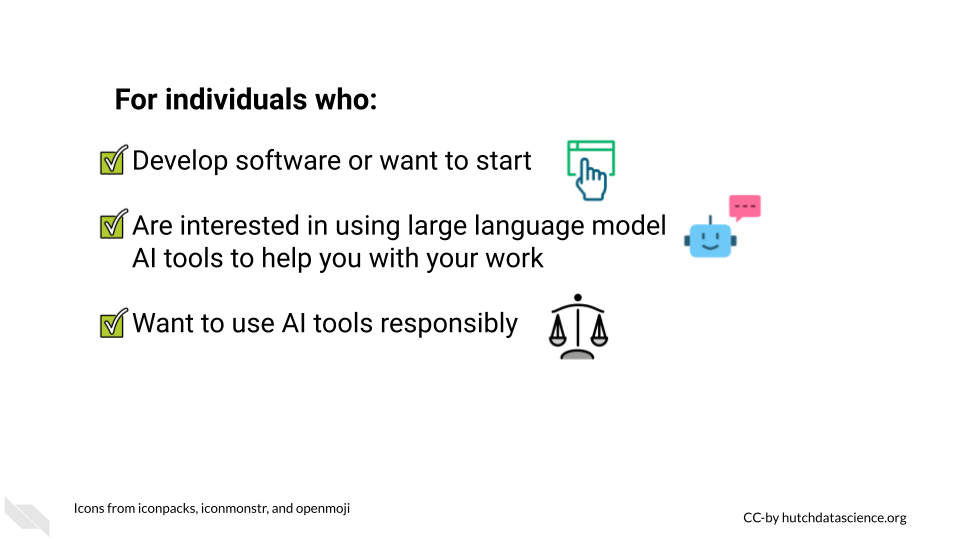

# About this Course {-}

This course on AI for software development explores the use of AI large language models such as ChatGPT, Bard, and others and their potential benefits and challenges. Through examples and hands-on activities, students will develop an understanding of the ways in which AI can speed up software development tasks and free up time for more creative and strategic work. By the end of the course, students will be equipped to navigate the rapidly changing landscape of software development and use AI chatbots in a way that maximizes benefits and efficiency while limiting harm as much as possible.

## Available course formats {-}

This course is available in multiple formats which allows you to take it in the way that best suits your needs.

- The material for this course can be viewed without login requirement on this [Bookdown website]( hutchdatascience.org/AI_for_software/). This format might be most appropriate for you if you rely on screen-reader technology.
<!-- - This course can be taken for [free certification through Leanpub](LINK HERE). -->
<!-- - This course can be taken on [Coursera for certification here](LINK HERE) (but it is not available for free on Coursera). -->
- Our courses are open source, you can find the [source material for this course on GitHub](https://github.com/fhdsl/AI_for_software/).
- The slides for the images in the course can be found [here](https://docs.google.com/presentation/d/1MCNeSO4aOm1iESWDLOGTcx3aLEbnu8UttV0QGVAeafE/edit?usp=sharing).

## Suggested Activity Context {-}

**Course Audience**  

- Professionals looking to improve efficiency
- Students hoping to learn more about programming
- Anyone curious about how AI can be harnessed for technology

**Course Prerequisites**  

- Some previous exposure to programming recommended.

**Assessment Type**  

- Hands-on activities following each lesson.

## Learning Objectives {-}

- Explain the basics of AI and its potential for improving software development workflows.
- Implement strategies to write and debug code using AI-based tools.
- Describe the benefits of refactoring code using AI-powered techniques, such as making code readable, keeping it brief, and optimizing code.
- Apply best practices for annotating code using AI.
- Recognize strategies for using AI-based tools to understand and analyze code, such as code comprehension of unfamiliar languages or functions.
- Discuss the challenges and ethical implications of using AI for different aspects of software development.

## Lesson Breakdown {-}

| Activity | Duration |
| :-- | :-- |
| [Introduction](https://hutchdatascience.org/AI_for_software/introduction.html) | 10 minutes |
|[Ethics for Using AI](https://hutchdatascience.org/AI_for_software/ethics-of-using-ai.html) | 20 minutes |
| [Writing Code](https://hutchdatascience.org/AI_for_software/writing-code.html) | 35 minutes |
| [Writing Exercise](https://hutchdatascience.org/AI_for_software/writing-code.html#hands-on-exercise) | 15 minutes |
| [Refactoring Code](https://hutchdatascience.org/AI_for_software/refactoring-code.html) | 35 minutes |
| [Refactoring Exercise](https://hutchdatascience.org/AI_for_software/refactoring-code.html#hands-on-exercise) | 15 minutes |
| [Annotating Code](https://hutchdatascience.org/AI_for_software/annotating-your-code.html) | 25 minutes |
| [Understanding Code](https://hutchdatascience.org/AI_for_software/understanding-unfamiliar-code.html) | 25 minutes |
| [Understanding Exercise](https://hutchdatascience.org/AI_for_software/understanding-unfamiliar-code.html#hamds-on-exercise) | 10 minutes |
| **Total** | 3 hours & 10 minutes |

