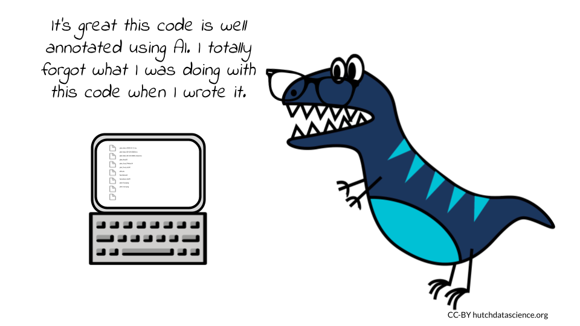
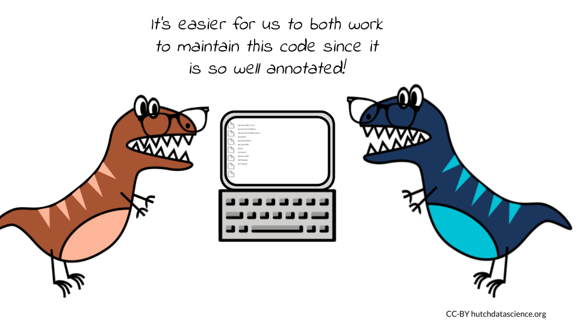
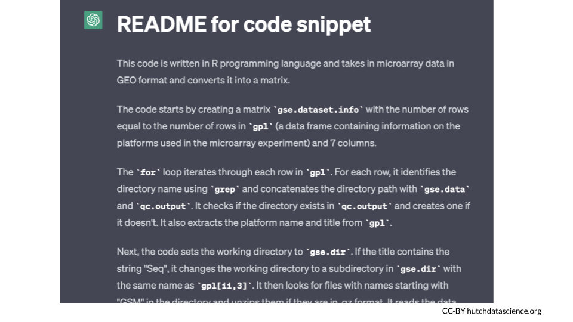
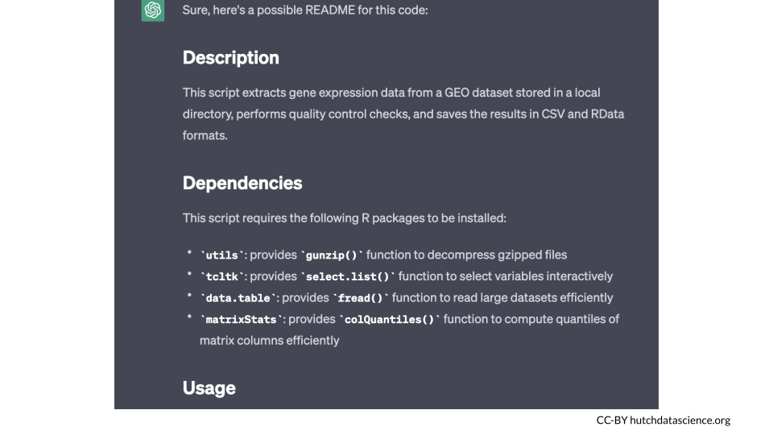

# Annotating Your Code

Code annotation, also known as code commenting, is the process of adding explanatory notes to source code. These notes are used to provide context, clarify functionality, and aid in understanding for developers who may be working on the codebase in the future. Code annotation is an important practice for any developer looking to write clear, efficient, and maintainable code.

There are many benefits to annotating code.

## Improves readability



First, it can help to improve the readability of code. By adding comments, developers can explain the purpose of each section of code, which can make it easier for others to understand what the code is doing. This can be especially helpful for large or complex codebases, where it can be difficult to keep track of all the different components. This is particularly important in contexts where the original developer of a project may move on to something else and others are left to work on them. Annotation perhaps most often helps a developer remember things they knew about the code when they were originally writing it (annotation is helpful for future you!) If the original developer left well-annotated code, it can drastically improve the ability of others (and their future selves) to continue with the project.

### Examples of readability aiding comments

Comments that help readability **clarify what the code is doing**

**Function explanations:**  A comment at the beginning of a function or method can describe its purpose, parameters, and expected return values. This makes it easier for others to understand what the function does and how to use it.

```
# This function calculates the sum of two numbers
def add_numbers(x, y):
    return x + y
```

**Inline explanations:** Use inline comments to explain what a specific line or block of code does. This can help someone reading your code to quickly understand what's going on.
```
# Loop through each item in the list
for item in my_list:
    # Check if the item is greater than 10
    if item > 10:
        # Print the item
        print(item)
```

**TODO comments:** Use TODO comments to mark areas of your code that need further work or improvement. This can help you or others to remember to come back to a specific part of the code.

```
# TODO: Implement error handling for this function
def my_function():
    pass
```

**Parameter descriptions:** If a function or method has complex parameters, it can be helpful to add comments explaining what each parameter does.

```
def my_function(parameter1, parameter2):
    """
    Calculate the sum of two numbers.

    Parameters:
    parameter1 (int): The first number to be added.
    parameter2 (int): The second number to be added.

    Returns:
    int: The sum of parameter1 and parameter2.
    """
    return parameter1 + parameter2
```

**Code block summary explanations:**  If you have a long or complex code block, you can add a comment to explain what the block is doing.

```
# This code block creates a dictionary containing the counts of each word in a list of text strings
word_counts = {}
for text in text_list:
    for word in text.split():
        if word not in word_counts:
            word_counts[word] = 0
        word_counts[word] += 1
```

### Improves maintainability



Code annotation can help to improve the maintainability of code. By adding comments, developers can explain the reasoning behind certain decisions, which can make it easier for others to make changes to the code without breaking it. This can be especially helpful when multiple developers are working on the same codebase, as it can help to prevent conflicts and ensure that the code is always in a consistent state.

### Examples of maintainability aiding comments

Comments that help maintainability **explain why the historical decisions of why code was made the way it was**

**Examples of maintainability aiding comments**

**Design decisions:** If there were specific design decisions made when creating the code, you can add comments explaining why certain choices were made.
bash

```
# We chose to use a linked list data structure for this function to reduce the time complexity of inserting and deleting elements.
```

**Legacy code:** Sometimes, code may have been written in a certain way due to constraints or limitations at the time it was created. Adding comments to explain this can help others understand why the code is the way it is.

```
# This code was written before Python 3, which introduced the `yield from` syntax. Therefore, we used a `for` loop to iterate over the nested list.
```

**Performance optimizations:** If certain performance optimizations were made to the code, you can add comments explaining why they were necessary.
bash

```
# We used memoization to improve the time complexity of this recursive function, as it was taking too long to execute for larger inputs.
```

**Compatibility considerations:** If the code was written with compatibility considerations in mind, you can add comments explaining why certain choices were made.

```
# We used the `os.path` module to ensure that this code will work on both Windows and Unix-based systems, as the path separators are different on each platform.
```

**Limitations:** If there are limitations or edge cases that the code cannot handle, you can add comments to explain this to others.

```
# Note that this function assumes that the input array is sorted in ascending order. If the array is unsorted, the results may be incorrect.
```

## Improves the quality


Code annotation can help to improve the quality of code. By adding comments, developers can identify potential issues or edge cases, which can help to prevent these issues from occurring in the first place. This can be especially helpful when testing code, as it can help to ensure that the code is working as expected.

## Examples of quality aiding comments

Comments that help improve the quality of the code **by explaining to other how to use or help improve it**

**Error handling:** Adding comments to explain how and why error handling is being implemented can help ensure that your code is robust and able to handle unexpected inputs or errors. This helps others know how the code was intended to be used.

```
# If the input argument is not a list or is empty, raise a ValueError
if not isinstance(input_list, list) or len(input_list) == 0:
    raise ValueError("Input list cannot be empty")
```

**Overcomplexity:** If your code has particular complexities, adding comments that explain it can help others understand the performance characteristics of your code. It may help others identify whether there is a simpler way to write the code. By adding a comment that expresses uncertainty about the code and asking for suggestions, the author can potentially receive feedback from others on how to improve the code.

```
# This block of code could probably be simplified, but I'm not sure how.
new_list = []
for i in old_list:
    if i > 0:
        new_list.append(i)
```

**Constants and variables:** Adding comments to explain the purpose of constants and variables can make your code easier to use. It not only notifies others of the variables existence but lets them know if they need to change the parameters for their own purposes.

```
# This constant represents the maximum allowed number of retries when attempting to connect to the server.
MAX_RETRIES = 3

# This variable tracks the number of failed attempts to connect to the server.
num_retries = 0
```

**Code organization or disorganization:** Adding comments to explain the organization and structure of your code can make it easier for others to navigate and may bring out a better organizational strategy for your code.

```
# Define helper functions for data processing
def preprocess_data(input_data):
    # Implementation details

def analyze_data(processed_data):
    # Implementation details

def visualize_data(analyzed_data):
    # Implementation details

# Load data from file
input_data = load_data("input.txt")

# Preprocess data
processed_data = preprocess_data(input_data)

# Analyze data
analyzed_data = analyze_data(processed_data)

# Visualize data
visualize_data(analyzed_data)
```

**Assumptions and constraints:** Adding comments to explain the assumptions and constraints of your code can help others understand its limitations and potential pitfalls.

```
# This function assumes that all input values are positive integers. Negative or non-integer inputs may result in unexpected behavior.
```

## AI in Code Annotation


We've discussed why code annotation and documentation are important, but when and why would you use AI for code annotation? AI can be a nice tool to supplement the annotation of your code. It should not be the only source of annotation for your code, because as the code author, you need to verify that what AI has annotated is consistent with your knowledge and history of development of the code.

 But using AI to annotate your code can be useful to supplement existing code annotations or to annotate old code that was poorly annotated either by yourself or others who are no longer working on the project.

 Here are some of the benefits of using AI for code annotation:

1. **Speed and efficiency:** AI algorithms can analyze code much faster than humans, which means they can quickly generate comments and annotations for large codebases. This can save developers significant time and effort, allowing them to focus on other aspects of the development process.

1. **Consistency:** Unlike humans, AI is not affected by personal biases or preferences, so it can provide consistent annotations across different code files and projects. This can help ensure that all code in a project is well-documented and easy to understand.

1. **Objectivity:** AI can analyze code objectively and identify potential issues that may have been missed by humans. This can lead to better quality code that is easier to maintain and less prone to errors.

1. **Learning:** AI models can learn from large datasets of annotated code and improve their ability to generate comments and annotations over time. This means that the more code the AI model analyzes, the more accurate and effective it becomes at annotating code.

1. **Specificity:** AI models can be trained on specific programming languages, frameworks, or libraries, allowing them to generate language-specific comments and annotations that are tailored to the needs of the project. This can be particularly helpful for large, complex projects that require specialized knowledge or expertise.

## Ethics of using AI to annotate code

However, there are also a number of potential ethical concerns associated with using AI to annotate code. For example, we don't yet know how and it what ways AI models may be biased. Additionally, AI models may be opaque, which could make it difficult to understand why they made certain annotations. Finally, because AI models are not humans and don't necessarily tell the stories behind the code, they may be used to generate annotations that are not accurate, helpful, or do not tell the full depth of the history of what occurred with the code, which could lead to problems.

Given these potential benefits and concerns, it is important for users of AI to always realize that they are ultimately accountable for the annotation that AI model makes and careful review of this annotation is needed.

There are a number of ethical considerations to take into account when using AI to annotate code. Here are a few of the most important ones:

1. **Accountability:** First and foremost, a user of AI is always primarily accountable for any output that they use from an AI model. AI models can give you annotation to start with, but it is up to you as the user to verify and review this output carefully. The user of the AI model is ultimately responsible keeping or throwing out the annotations the AI makes and thus is responsible for using errors that the model makes. Much like a user of a Google Search engine is responsible for which results they use, a user of AI is responsible what output from the AI model they use.

2. **Transparency:** It is important to be transparent about the use of AI in code annotation. This means disclosing the fact that AI is being used, as well as the specific AI model and dataset that is being used. This should be stated on every file where annotation has been made using AI. This transparency allows others who view the code to be able more fully interpret the AI-created annotation that accompanies the code.

3. **Bias:** AI models are trained on data, and this data can introduce bias into the model. It is important to be aware of the potential for bias and to take steps to mitigate it. This can be done by using a diverse dataset, by carefully selecting the features that are used to train the model, and by using techniques such as adversarial training.
TODO: How does this relate to annotation?

4. **Explainability:** It is important to be able to explain the decisions that an AI model makes. This is especially important in the case of code annotation, where the decisions made by the AI model can have a significant impact on the quality of the code. There are a number of techniques that can be used to explain the decisions of an AI model, such as visualization and rule extraction.

## Examples on using AI for annotation

### Ask for a README summary

To try out some annotation with code examples, this author dug up some old code that she has no idea what it does because time has passed and at the time she didn't document it very well.

First, I wanted ChatGPT to make a README for me. README's are a standard file that explain what the code base does and provides a summary of what is happening in the set. I asked ChatGPT if it could:

:::{.query}
Create a README for this code
:::

and then I pasted the old code.


ChatGPT gave me some output that generally looked like a README:



This README seems accurate given the work I was doing at the time. But obviously the title isn't great -- it doesn't describe the code well. Plus there's not really information about usage or outputs of the code.

So I asked it:

:::{.query}
Can you make this README more succinct and with sections about how you would use this code?
:::

This yielded a much better result.



### Ask for line by line annotation

Second, I wanted to have ChatGPT annotate code line by line. So I asked it

:::{.query}
Can you annotate some R code for me?
:::


 It not only provided helpful annotations but it fixed spacing and added more spaces between lines of code:


It does however, think the code is Python apparently if we look in the upper left corner.
But this doesn't seem to have affected its accuracy in its annotations.

### Ask for how the code could be improved

This code is old, and I don't think it runs properly and is in no way reproducible. So I wanted to see what ChatGPT would recommend for improvements to the code. I said

:::{.query}
How could I make this code better?
:::

It had a lot of great advice:


First and foremost it told me my variable names are not consistent and also not descriptive. Which is completely accurate! There's variable names like `xx` and `ll` which don't tell the reader anything about the variable.

### Style the code

Next, I asked chatGPT if it could restyle the code into tidyverse style. It definitely put elements that look like tidyverse however, it also put items in the code that I can tell by looking at it won't work.  

So I tried to tell it about the errors:
:::{.query}
This code is close but there are some errors. tidyverse functions don't work with matrices
:::

and it told me:

```
You are correct that the tidyverse functions are designed to work with data frames and not matrices. Here's a modified version of your code that converts the matrix to a data frame and uses tidyverse functions:
```

The lesson here is that the output of chatGPT still needs to be vetted by the person asking for it. It is a great idea to continue to have AI's work on something if it isn't quite what you are asking for, however, at the end of the day it is you, the human, who has to vet the output.

### Sometimes it has trouble with file types if given a URL

Copying and pasting code appears to be the best way to go at this point in time.

I asked chatGPT if it could annotate code in a Jupyter notebook at a URL I gave it:

:::{.query}
Can you annotate the code at this URL? https://github.com/jhudsl/reproducible-python-example/blob/main/make_heatmap.ipynb
:::

It responded with some of the code at that file where it was annotated but most of the notebook was not there.

I told ChatGPT:

:::{.query}
That isn't all the code at that url
:::

ChatGPT told me:

```
You're right, I apologize. The code at the given URL is actually in a Jupyter Notebook format, so it's not easy to copy-paste here. However, I can suggest an alternative approach: you can use the website nbviewer (https://nbviewer.jupyter.org/) to view the notebook and its code. Here are the steps to do so:

Go to https://nbviewer.jupyter.org/
Paste the URL of the notebook (https://github.com/jhudsl/reproducible-python-example/blob/main/make_heatmap.ipynb) into the "Enter the location of a Jupyter Notebook" field and press "Go".
This will display the notebook and its code, and you can read through it and add your own annotations as needed.
I hope this helps!
```

This was a nice tool to recommend, however it still told me I should add my own annotations at the end of this.

## Summary

- Code annotation is important for readability, maintainability, and overall quality of code
- AI can be a helpful tool for supplementing annotations or creating annotation for poorly annotated code.
- Ultimately the code author who uses AI as a tool for annotation is still ultimately responsible for verifying that the annotations are consistent with their knowledge of the code.


```r
devtools::session_info()
```

```
## ─ Session info ───────────────────────────────────────────────────────────────
##  setting  value                       
##  version  R version 4.0.2 (2020-06-22)
##  os       Ubuntu 20.04.5 LTS          
##  system   x86_64, linux-gnu           
##  ui       X11                         
##  language (EN)                        
##  collate  en_US.UTF-8                 
##  ctype    en_US.UTF-8                 
##  tz       Etc/UTC                     
##  date     2023-04-21                  
## 
## ─ Packages ───────────────────────────────────────────────────────────────────
##  package     * version date       lib source                            
##  assertthat    0.2.1   2019-03-21 [1] RSPM (R 4.0.5)                    
##  bookdown      0.24    2023-03-28 [1] Github (rstudio/bookdown@88bc4ea) 
##  bslib         0.4.2   2022-12-16 [1] CRAN (R 4.0.2)                    
##  cachem        1.0.7   2023-02-24 [1] CRAN (R 4.0.2)                    
##  callr         3.5.0   2020-10-08 [1] RSPM (R 4.0.2)                    
##  cli           3.6.1   2023-03-23 [1] CRAN (R 4.0.2)                    
##  crayon        1.3.4   2017-09-16 [1] RSPM (R 4.0.0)                    
##  curl          4.3     2019-12-02 [1] RSPM (R 4.0.3)                    
##  desc          1.2.0   2018-05-01 [1] RSPM (R 4.0.3)                    
##  devtools      2.3.2   2020-09-18 [1] RSPM (R 4.0.3)                    
##  digest        0.6.25  2020-02-23 [1] RSPM (R 4.0.0)                    
##  ellipsis      0.3.1   2020-05-15 [1] RSPM (R 4.0.3)                    
##  evaluate      0.20    2023-01-17 [1] CRAN (R 4.0.2)                    
##  fansi         0.4.1   2020-01-08 [1] RSPM (R 4.0.0)                    
##  fastmap       1.1.1   2023-02-24 [1] CRAN (R 4.0.2)                    
##  fs            1.5.0   2020-07-31 [1] RSPM (R 4.0.3)                    
##  glue          1.4.2   2020-08-27 [1] RSPM (R 4.0.5)                    
##  highr         0.8     2019-03-20 [1] RSPM (R 4.0.3)                    
##  hms           0.5.3   2020-01-08 [1] RSPM (R 4.0.0)                    
##  htmltools     0.5.5   2023-03-23 [1] CRAN (R 4.0.2)                    
##  httr          1.4.2   2020-07-20 [1] RSPM (R 4.0.3)                    
##  jquerylib     0.1.4   2021-04-26 [1] CRAN (R 4.0.2)                    
##  jsonlite      1.7.1   2020-09-07 [1] RSPM (R 4.0.2)                    
##  knitr         1.33    2023-03-28 [1] Github (yihui/knitr@a1052d1)      
##  lifecycle     1.0.3   2022-10-07 [1] CRAN (R 4.0.2)                    
##  magrittr      2.0.3   2022-03-30 [1] CRAN (R 4.0.2)                    
##  memoise       2.0.1   2021-11-26 [1] CRAN (R 4.0.2)                    
##  ottrpal       1.0.1   2023-03-28 [1] Github (jhudsl/ottrpal@151e412)   
##  pillar        1.9.0   2023-03-22 [1] CRAN (R 4.0.2)                    
##  pkgbuild      1.1.0   2020-07-13 [1] RSPM (R 4.0.2)                    
##  pkgconfig     2.0.3   2019-09-22 [1] RSPM (R 4.0.3)                    
##  pkgload       1.1.0   2020-05-29 [1] RSPM (R 4.0.3)                    
##  prettyunits   1.1.1   2020-01-24 [1] RSPM (R 4.0.3)                    
##  processx      3.4.4   2020-09-03 [1] RSPM (R 4.0.2)                    
##  ps            1.4.0   2020-10-07 [1] RSPM (R 4.0.2)                    
##  R6            2.4.1   2019-11-12 [1] RSPM (R 4.0.0)                    
##  readr         1.4.0   2020-10-05 [1] RSPM (R 4.0.2)                    
##  remotes       2.2.0   2020-07-21 [1] RSPM (R 4.0.3)                    
##  rlang         1.1.0   2023-03-14 [1] CRAN (R 4.0.2)                    
##  rmarkdown     2.10    2023-03-28 [1] Github (rstudio/rmarkdown@02d3c25)
##  rprojroot     2.0.3   2022-04-02 [1] CRAN (R 4.0.2)                    
##  sass          0.4.5   2023-01-24 [1] CRAN (R 4.0.2)                    
##  sessioninfo   1.1.1   2018-11-05 [1] RSPM (R 4.0.3)                    
##  stringi       1.5.3   2020-09-09 [1] RSPM (R 4.0.3)                    
##  stringr       1.4.0   2019-02-10 [1] RSPM (R 4.0.3)                    
##  testthat      3.0.1   2023-03-28 [1] Github (R-lib/testthat@e99155a)   
##  tibble        3.2.1   2023-03-20 [1] CRAN (R 4.0.2)                    
##  usethis       1.6.3   2020-09-17 [1] RSPM (R 4.0.2)                    
##  utf8          1.1.4   2018-05-24 [1] RSPM (R 4.0.3)                    
##  vctrs         0.6.1   2023-03-22 [1] CRAN (R 4.0.2)                    
##  withr         2.3.0   2020-09-22 [1] RSPM (R 4.0.2)                    
##  xfun          0.26    2023-03-28 [1] Github (yihui/xfun@74c2a66)       
##  yaml          2.2.1   2020-02-01 [1] RSPM (R 4.0.3)                    
## 
## [1] /usr/local/lib/R/site-library
## [2] /usr/local/lib/R/library
```
