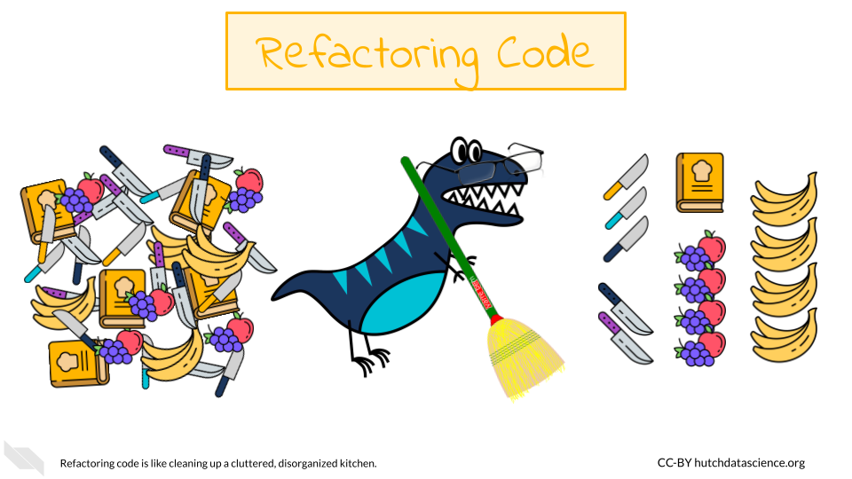
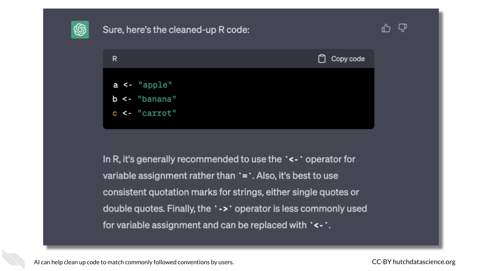
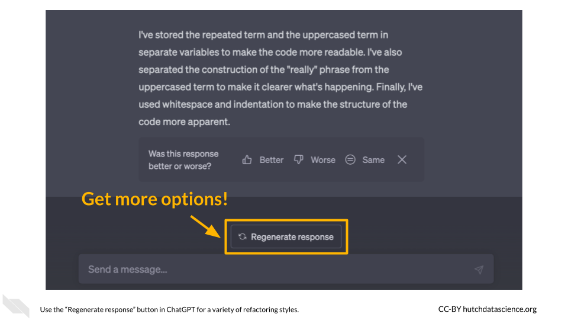

# Refactoring Code

## Learning Objectives

- Describe how refactoring code involves optimization for maintainability, efficiency, and reuse
- Explain why refactoring code is important for developers in the long-term 
- Recognize the benefits and limitations of using AI tools to refactor code, as well as why AI tools are uniquely poised to be beneficial
- Implement prompt strategies that can be used to assist with refactoring code for correcting syntax, for adopting more consistent styling, for making code more concise, for making code easier to maintain, and for making code more efficient

## Refactoring Basics

[Code refactoring](https://en.wikipedia.org/wiki/Code_refactoring) is the process of improving the quality of underlying code without changing its functionality. In other words, it's a way of cleaning up and optimizing code so that it's easier to maintain and more efficient. This often involves making small changes to the code, such as renaming variables or functions, reorganizing code blocks, or simplifying complex expressions. Refactoring is an essential practice in software development and helps to ensure that the codebase remains manageable and adaptable as requirements and business needs change over time.

Code refactoring helps to reduce [technical debt](https://en.wikipedia.org/wiki/Technical_debt), which is the accumulation of development work that needs to be done in the future as a result of taking shortcuts or using less than optimal solutions. Refactoring can help to identify potential issues and bugs before they cause problems, resulting in more stable software. Finally, refactoring code to be more readable and less verbose can create fewer headaches for you in the future.

To understand why code refactoring is important, imagine trying to cook in a disorganized and cluttered kitchen. You might be a fantastic cook, but you are spending more time searching for utensils and ingredients, and the quality of the meal could suffer as a result. Similarly, code that is disorganized and cluttered can be difficult to work with and can result in lower-quality software. Refactoring is like cleaning and organizing the kitchen - it makes the process of cooking (or coding) smoother and more efficient.




## AI in Code Refactoring

Code refactoring has historically been done manually by developers. This involves reviewing code and identifying areas that could be improved or optimized, and then making changes to the codebase accordingly. Though important, this is process is time-consuming and labor-intensive, as it requires developers to carefully review every line of code to identify potential issues or areas for improvement. Additionally, manual code refactoring is error-prone, as developers can accidentally introduce bugs or errors into the codebase while making changes.

However, AI has significant potential to help with code refactoring. AI can use machine learning algorithms to analyze large amounts of code and identify patterns or areas that could be improved. For example, they can identify sections of code that are redundant, overly complex, or difficult to maintain, and suggest changes that could be made to improve the codebase. Machine learning algorithms can also help to identify potential bugs or security issues in the codebase, which can help to improve the overall quality and stability of the software.

AI refactoring is also faster and more accurate than manual refactoring. This is particularly useful for large-scale software projects with massive codebases, where manual code review and refactoring can be an enormous task. In the next sections, we'll take a look at some examples of using AI to refactor code.

## Example One: Correcting Syntax

Programming languages operate using their established set of rules. For example, [Python](https://www.python.org/) uses indentation to define code blocks. However, when you shift between development environments, indentation and line breaks can sometimes be affected, causing major headaches! 

Let's say we run the following code:


```python
def calculate_sum(a,b):
 result = a + b
  return result
def calculate_product(a,b):result = a * b
return result

def main():
  a=5
 b=6
sum_result = calculate_sum(a, b)
print("Sum:", sum_result)
product_result = calculate_product(a,b)
print("Product:", product_result)

if __name__ == '__main__':
main()
```

```
## unexpected indent (<string>, line 3)
```

We get the error above because our indentation is off. Let's ask [ChatGPT](https://chat.openai.com) to clean things up.

:::{.query}
Can you assist me with correcting the formatting and indentation issues in my Python code?
:::

:::{.ai_response}
Of course! Here is the code after correcting the formatting and indentation:


```python
def calculate_sum(a, b):
    result = a + b
    return result


def calculate_product(a, b):
    result = a * b
    return result


def main():
    a = 5
    b = 6
    sum_result = calculate_sum(a, b)
    print("Sum:", sum_result)
    product_result = calculate_product(a, b)
    print("Product:", product_result)


if __name__ == '__main__':
    main()
```

```
## Sum: 11
## Product: 30
```

:::

Much better! This can be quite handy when you can't immediately see what is wrong with the formatting or if you are working with a large codebase. 

## Example Two: Styling and Convention

Sometimes programming languages have more flexible rules where there are multiple ways to take the same or almost the same action. For example, in the [R programming language](https://www.r-project.org/), there are several ways to perform variable assignment. However, is is generally accepted among R programmers that the `<-` operator should be used. Single and double quotes can be used for character types interchangeably, but it's generally a good idea to stick with one or the other.

### Commonly Accepted Convention

Let's say we have the following code:


```r
a <- "apple"
b = 'banana'
"carrot" -> c

c(a, b, c)
```

```
## [1] "apple"  "banana" "carrot"
```

This code does not produce any errors, but it doesn't follow typical R convention. Let's ask ChatGPT to clean things up.

:::{.query}
Can you help me reformat my R code to follow accepted style conventions?
:::

:::{.ai_response}
Sure, here's the cleaned-up R code:


```r
a <- "apple"
b <- "banana"
c <- "carrot"
```

:::

Much better! This code will now look more familiar to other R programmers.



### Visual Styling

Some languages are flexible about line breaks, indentation, and spacing among code blocks. If you're rapidly developing, things can get messy pretty quickly. Many development environments, for example RStudio and PyCharm, have the ability to format your code for you without changing any of the code itself. However, you can also get AI to do this according to your own preferences.


```r
d <- c(rep(a,5),rep(b,5),rep(c,5),paste(a,b,c),paste(c,b,a))
```

This code is pretty hard to read. Let's see if AI can do better.

:::{.query}
Can you space out this R code to make it more readable?
:::

:::{.ai_response}
Sure! Here's the same code with added spacing for improved readability:


```r
d <- c(rep(a, 5), 
       rep(b, 5), 
       rep(c, 5), 
       paste(a, b, c), 
       paste(c, b, a))
```

:::

Better! It's easier to interpret because only one action is being taken on each step. By spacing out the code and breaking it into multiple lines, it becomes easier for the human eye to scan for structure, logic, errors, and/or inconsistencies.

## Example Three: Staying DRY

The DRY (Don't Repeat Yourself) programming tenet is essential to good software. By avoiding repetition in code, we can reduce the amount of duplicate code we need to write and maintain. If we need to change the functionality of a certain piece of code, we have to make the same change in multiple places, which can be time-consuming and error-prone.

Let's take the following Python code:


```python
def print_greetings():
    print("Hello, Alice!")
    print("Hello, Bob!")
    print("Hello, Carol!")
    print("Hello, David!")
    print("Hello, Eve!")

print_greetings()
```

```
## Hello, Alice!
## Hello, Bob!
## Hello, Carol!
## Hello, David!
## Hello, Eve!
```

Notice how repetitive this code is? `print()` and the string `"Hello, "` appear five times. We can improve this!

:::{.query}
Could you please refactor my Python code to make it more DRY?
:::

:::{.ai_response}
Sure, here's a refactored version of your code:


```python
def print_greeting(name):
    print(f"Hello, {name}!")

def print_greetings():
    names = ["Alice", "Bob", "Carol", "David", "Eve"]
    for name in names:
        print_greeting(name)

print_greetings()
```

```
## Hello, Alice!
## Hello, Bob!
## Hello, Carol!
## Hello, David!
## Hello, Eve!
```
:::

Now let's imagine your software lead has asked us to change the greeting to Spanish. Notice how we only have to change the second line of code:


```python
def print_greeting(name):
    print(f"¡Hola, {name}!")

def print_greetings():
    names = ["Alice", "Bob", "Carol", "David", "Eve"]
    for name in names:
        print_greeting(name)

print_greetings()
```

```
## ¡Hola, Alice!
## ¡Hola, Bob!
## ¡Hola, Carol!
## ¡Hola, David!
## ¡Hola, Eve!
```

Much easier.

## Example Four: Keeping Code Alive

During software development, code is often changing rapidly. It's common to end up with functions or variables you don't need anymore. It's best practice to remove "dead" code from your codebase: it's distracting and can make maintenance more challenging. Programmers should resist the urge to hang on to unused code in the expectation that they might need it one day. Version control, such as provided by git and GitHub, let you keep a record of old code without cluttering your final version.

Let's take a look at some Python code with some dead code:


```python
def default_values():
    a = 5
    b = 6
    return a, b

def calculate_sum(a, b):
    result = a + b
    return result

def calculate_product(x, y):
    return x * y
  
def simulate_data():
    a, b = default_values()
    dat = calculate_sum(a, b) + calculate_sum(a, b)
    return dat

def main():
    a = 5
    b = 6
    a, b = default_values()
    sum_result = calculate_sum(a, b)
    print("Sum:", sum_result)

if __name__ == '__main__':
    main()
```

```
## Sum: 11
```

Some of these functions aren't used in the final step, typically defined in python as the `main()` function. Let's ask AI to remove them.

:::{.query}
I need help with eliminating unused functions in my Python script.
:::

:::{.ai_response}
Sure! Here's a refactored version:


```python
def default_values():
    a = 5
    b = 6
    return a, b

def calculate_sum(a, b):
    result = a + b
    return result

def main():
    a = 5
    b = 6
    a, b = default_values()
    sum_result = calculate_sum(a, b)
    print("Sum:", sum_result)

if __name__ == '__main__':
    main()
```

```
## Sum: 11
```
:::

Great! Now our code is much more manageable. This code only includes the necessary functions needed to run the `main()` function. We can go a step further!

:::{.query}
Can you help me refactor my python code to make it more concise?
:::

:::{.ai_response}
Certainly! Here's a more concise version of your code:


```python
def calculate_sum(a=5, b=6):
    return a + b

def main():
    sum_result = calculate_sum()
    print("Sum:", sum_result)

if __name__ == '__main__':
    main()
```

```
## Sum: 11
```
:::

In this version, the `calculate_sum` function is simplified to take default arguments for a and b. This means the `default_values` function is no longer necessary. The a and b variables are also removed from `main`, as they are no longer needed. Much better and easier to look at overall.

## Example Five: Making Code Readable

Usually, our first goal as programmers is to get the response we need from the code. Readability might be the last thing on our minds. Luckily, AI can help with this. Let's imagine we whipped up this code pretty quickly. It is tough to read, and it could definitely be improved.


```r
for(term in c("good","bad","ugly")){
  print(c(rep(term,3),paste("really",stringr::str_to_upper(term))))
}
```

```
## [1] "good"        "good"        "good"        "really GOOD"
## [1] "bad"        "bad"        "bad"        "really BAD"
## [1] "ugly"        "ugly"        "ugly"        "really UGLY"
```

Let's see if AI can do better.

:::{.query}
Can you help me clean up this R code so it is more readable?
:::

:::{.ai_response}
Sure! Here's a more readable version of the code:


```r
library(stringr)

for(term in c("good", "bad", "ugly")) {
  print(c(rep(term, 3), paste("really", str_to_upper(term))))
}
```

```
## [1] "good"        "good"        "good"        "really GOOD"
## [1] "bad"        "bad"        "bad"        "really BAD"
## [1] "ugly"        "ugly"        "ugly"        "really UGLY"
```

I added whitespace around operators and after commas for better readability. I also loaded the `stringr` package explicitly using `library()` to make the code more self-contained.
:::

This is a good start, but not much has changed. Let's try again. On ChatGPT, we can click "Regenerate Response".

:::{.ai_response}
Here's a cleaned-up version of the R code that is more readable:


```r
library(stringr)

terms <- c("good", "bad", "ugly")

for (term in terms) {
  rep_term <- rep(term, 3)
  upper_term <- str_to_upper(term)
  really_upper_term <- paste("really", upper_term)
  result <- c(rep_term, really_upper_term)
  print(result)
}
```

```
## [1] "good"        "good"        "good"        "really GOOD"
## [1] "bad"        "bad"        "bad"        "really BAD"
## [1] "ugly"        "ugly"        "ugly"        "really UGLY"
```

I've stored the repeated term and the uppercased term in separate variables to make the code more readable. I've also separated the construction of the "really" phrase from the uppercased term to make it clearer what's happening. Finally, I've used whitespace and indentation to make the structure of the code more apparent.

:::

Better! While the code takes up a greater number of lines, it's easier to interpret because only one action is being taken on each step.



## Example Six: Keep it Brief

As we learned above, following the DRY principle and removing dead code can make your code easier to interpret, maintain, and debug. However, sometimes the issue is the functions themselves. No one has perfect knowledge of everything in their programming language. AI can help us determine if there are any more efficient sets of functions that do the same thing. Here is some code that plays with the "CO2" dataset in R:


```r
library(datasets)

for (type in unique(CO2$Type)) {
  dat_subset <- CO2[CO2$Type == type, ]
  for (plant in unique(dat_subset$Plant)) {
    dat_subset_2 <- dat_subset[dat_subset$Plant == plant, ]
    print(paste(dat_subset_2$Plant[1], round(mean(dat_subset_2$uptake), 1)))
  }
}
```

```
## [1] "Qn1 33.2"
## [1] "Qn2 35.2"
## [1] "Qn3 37.6"
## [1] "Qc1 30"
## [1] "Qc2 32.7"
## [1] "Qc3 32.6"
## [1] "Mn1 26.4"
## [1] "Mn2 27.3"
## [1] "Mn3 24.1"
## [1] "Mc1 18"
## [1] "Mc2 12.1"
## [1] "Mc3 17.3"
```

Let's see if AI has any ideas for making it more concise.

:::{.query}
Can you make this code more concise?
:::

:::{.ai_response}
Here's a more concise version using `dplyr` package in R:


```r
library(dplyr)

CO2 %>%
  group_by(Type, Plant) %>%
  summarize(mean_uptake = mean(uptake))
```

```
## # A tibble: 12 × 3
## # Groups:   Type [2]
##    Type        Plant mean_uptake
##    <fct>       <ord>       <dbl>
##  1 Quebec      Qn1          33.2
##  2 Quebec      Qn2          35.2
##  3 Quebec      Qn3          37.6
##  4 Quebec      Qc1          30.0
##  5 Quebec      Qc3          32.6
##  6 Quebec      Qc2          32.7
##  7 Mississippi Mn3          24.1
##  8 Mississippi Mn2          27.3
##  9 Mississippi Mn1          26.4
## 10 Mississippi Mc2          12.1
## 11 Mississippi Mc3          17.3
## 12 Mississippi Mc1          18
```

This code groups the CO2 dataset by Type and Plant, calculates the mean uptake for each group using summarize, and then prints the resulting data frame. The code is shorter and more concise because it uses the `dplyr` package, which has built-in functions for data manipulation and summarization.
:::

Refactoring the code to be more concise using `dplyr` makes it easier to read and understand the steps involved in the data manipulation. It also reduces the number of nested loops and intermediate variables, making the code more efficient and reducing the chance of errors. Ultimately, it is your job as a programmer to use your best judgment on the fine balance between brevity and readability, as the best solution is not always this obvious.

:::{.notice}
Remember that you can regenerate the AI's response if you want more options.
:::

## Code optimization

Sometimes time and efficiency is of the essence. Loops can be slow and time consuming in many languages. Take for example the following R code that calculates the cross product between two vectors x and y using nested `for` loops:


```r
set.seed(123)
n <- 10000
x <- rnorm(n)
y <- rnorm(n)
z <- numeric(n)

# Start timer
start_time <- proc.time()

for(i in 1:n) {
  for(j in 1:n) {
    z[i] <- z[i] + x[i]*y[j]
  }
}

# End timer
proc.time() - start_time
```

```
##    user  system elapsed 
## 221.010   0.057 221.073
```

:::{.query}
What is a faster, more optimized way of running the following R code?
:::

:::{.ai_response}


```r
set.seed(123)
n <- 10000
x <- rnorm(n)
y <- rnorm(n)

# Start timer
start_time <- proc.time()

z <- outer(x, y, "*")
z <- rowSums(z)

# End timer
proc.time() - start_time
```

```
##    user  system elapsed 
##   0.771   0.220   0.850
```

The `outer()` function performs the same calculation as the nested loop in the original code, but more efficiently. It returns a matrix of all possible combinations of x and y values, with each element of the matrix being the product of the corresponding x and y values. The `rowSums()` function is then used to sum the elements of each row of the matrix, which is equivalent to summing the products of x and y for each index `i` in the original loop. This method avoids the need for the nested loop, resulting in a faster and more efficient computation.
:::

So much faster! We can look at another option by regenerating the response:

:::{.ai_response}

```r
set.seed(123)
n <- 10000
x <- rnorm(n)
y <- rnorm(n)
z <- numeric(n)

# Start timer
start_time <- proc.time()

z <- x %*% t(y)

# End timer
proc.time() - start_time
```

```
##    user  system elapsed 
##   0.333   0.264   0.365
```

One optimized way to perform the same calculation is by using the `%*%` operator to perform matrix multiplication. This can be done by converting x and y to matrices and transposing one of them so that their dimensions align for matrix multiplication. This code should be much faster than the original implementation because it takes advantage of highly optimized matrix multiplication algorithms in R.
:::

While this second suggestion is faster, you will need to consider what aspects of the codebase are most important in each instance. For example, this code runs more quickly, but [the `%*%` operator](https://stat.ethz.ch/R-manual/R-patched/library/base/html/matmult.html) might be unfamiliar to some R programmers. In cases where efficiency is less important, or the data are not large, you might consider maximizing readability. 

## Challenges and Limitations

Like humans, AI can make mistakes. Be sure to keep the following in mind as you use AI to refactor your code.

### Complexity

Refactoring is often a complex process that requires deep understanding of the code and its context. AI may not always be able to fully understand the complexity of the code and may struggle to identify the best refactoring strategy. Use a modular approach whenever possible.

### Limited Data

AI models require large amounts of data to learn from, but in the case of code refactoring, there is often limited data available. This can make it difficult for AI models to generalize to new code bases and situations, especially if you are using a more niche programming language.

### Quality Control

Automated refactoring tools that use AI may not always produce code that is of the same quality as code produced by human developers. It can be difficult to always ensure that the refactored code is maintainable, efficient, and free of bugs. You need to use your best judgment when copying and pasting AI-produced code into your codebase.

:::{.warning}
**You should always include unit tests in your code.** Tests can help you catch bugs, including those introduced accidentally by AI.
:::

Because AI models are created by humans, they can be biased. This means they may not always identify your preferred refactorings or may prioritize certain types of refactorings over others. In some cases, this can lead to suboptimal code quality and may create technical debt over time.

### Security

When using AI to refactor code, the code itself is often sent to an external service or platform for analysis and transformation. This can raise concerns about the security of the code, especially if it contains sensitive information such as trade secrets, proprietary algorithms, or personal data. If your code is sensitive, it's important to carefully vet any third-party AI tools or services used in the refactoring process.

## Hands-On Exercise

Now it's your turn to try. 

### The Code

Let's say you are dusting off some code from your past (no judgment here). You were investigating tweets about [Mr. Trash Wheel](https://www.mrtrashwheel.com/), a beloved Baltimore-based contraption that filters trash out of the waterways.

**Note**: This code is just an example and was written strictly for educational purposes.


```python
import tweepy
import pandas

# Enter your API keys and access tokens here
consumer_key = 'your_consumer_key'
consumer_secret = "your_consumer_secret"
access_token = 'your_access_token'
access_token_secret = 'your_access_token_secret'

# Authenticate with Twitter API
auth = tweepy.OAuthHandler(consumer_key, consumer_secret)
auth.set_access_token(access_token, access_token_secret)

# Search for tweets containing the search term
tweets = tweepy.Cursor(tweepy.API(auth).search_tweets, q="Mr. Trash Wheel", tweet_mode='extended').items(100)

# Create empty list to store tweet data
date_data = []
location_data = []
text_data = []

def get_tweet_length(tweet):
    # Return the length of the tweet text
    return len(tweet.full_text)

# Loop through each tweet and extract desired data
for tweet in tweets:
      date_info = {
        'date': tweet.created_at
    }
    date_data.append(date_info)

# Search for tweets containing the search term
tweets = tweepy.Cursor(tweepy.API(auth).search_tweets, q="Mr. Trash Wheel", tweet_mode='extended').items(100)

# Loop through each tweet and extract desired data
for tweet in tweets:
    location_info = {
        'location': tweet.user.location
    }
        location_data.append(location_info)
    
# Search for tweets containing the search term
tweets = tweepy.Cursor(tweepy.API(auth).search_tweets, q='Mr. Trash Wheel', tweet_mode='extended').items(100)
    
# Loop through each tweet and extract desired data
for tweet in tweets:
    text_info = {
        'text': tweet.full_text
    }
    text_data.append(text_info)

# Combine lists into a dictionary
data = {'date': date_data, 
  'location': location_data, 'text': text_data}

# Store results in pandas dataframe
df = pandas.DataFrame(data)

# Print dataframe
print(df)
```

### Questions

1. Create an AI prompt that fixes any formatting issues with the code that would cause it not to run.

1. Devise an AI prompt that removes any dead code from your sample above. What gets removed?

1. Create a prompt that makes the code less repetitive, adhering to the DRY principle. What aspect of the code was repetitive?

1. Construct a prompt that makes the code more concise. What are some trade-offs that appear in this code between readability and brevity?

## Summary

- Code refactoring is the process of improving code quality without changing its functionality. It is crucial in software development to maintain a manageable and adaptable codebase.

- Code refactoring reduces technical debt, improves code stability, and makes it easier to maintain.

- Examples of using AI for code refactoring include correcting syntax, adhering to styling and convention, visual styling, avoiding repetition, removing dead code, and improving both readability and speed of execution (optimization).

- The use of AI for code refactoring raises ethical concerns and is not perfect. It is important for the developer to consider security needs of their code, as well as test out their code.
